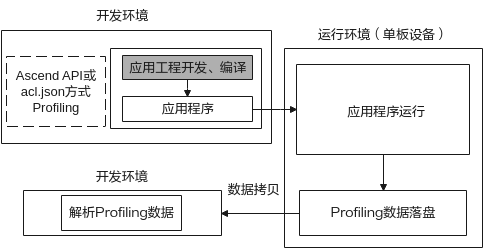
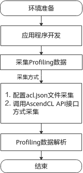
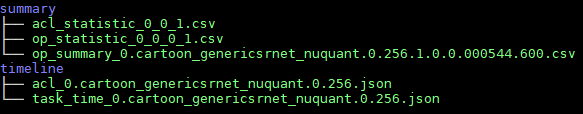
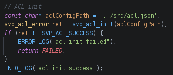
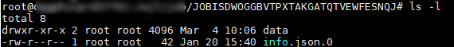
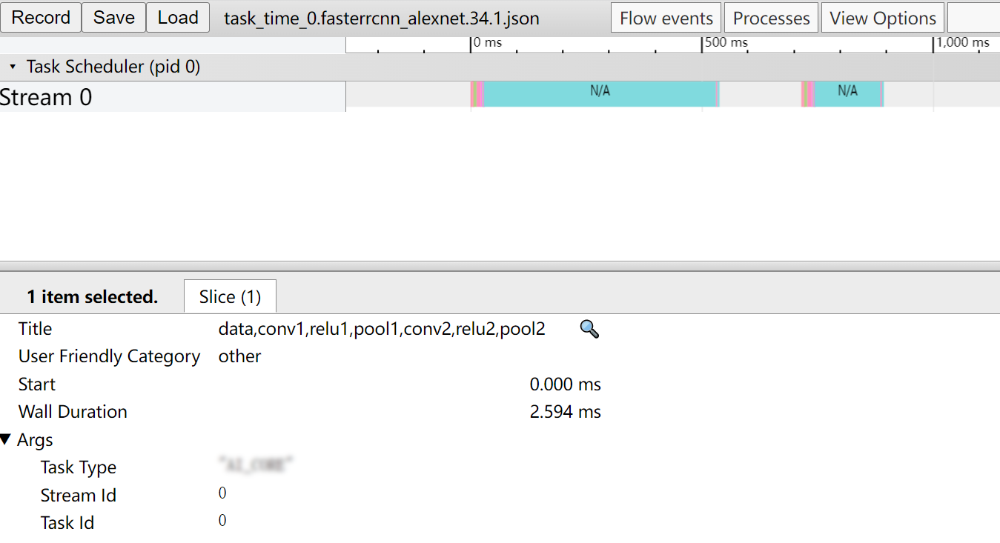
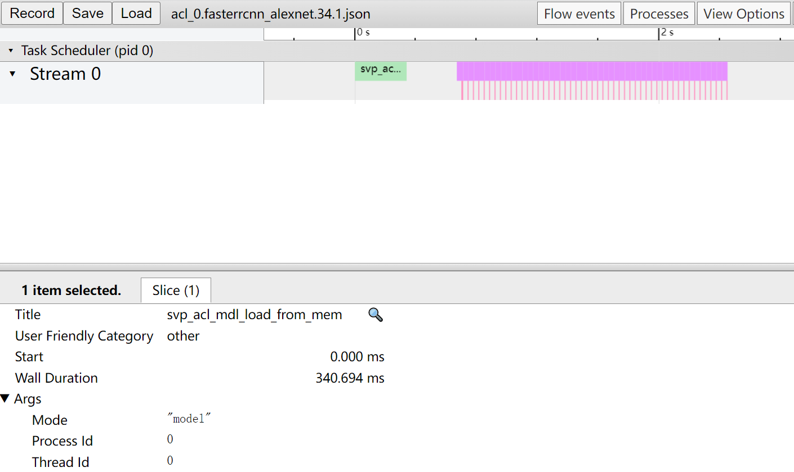
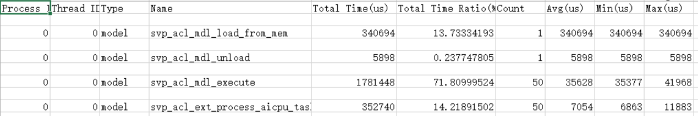

# Preface
**Overview<a name="section4537382116410"></a>**

This document provides a detailed description of the constraints, environment preparation, and specific operation guidance for the Profiling tool, as well as common FAQs and troubleshooting methods.

**Product Version<a name="section300mcpsimp"></a>**

The product versions corresponding to this document are as follows.

<a name="table303mcpsimp"></a>
<table><thead align="left"><tr id="row308mcpsimp"><th class="cellrowborder" valign="top" width="44.96%" id="mcps1.1.3.1.1"><p id="p310mcpsimp"><a name="p310mcpsimp"></a><a name="p310mcpsimp"></a>Product Name</p>
</th>
<th class="cellrowborder" valign="top" width="55.04%" id="mcps1.1.3.1.2"><p id="p312mcpsimp"><a name="p312mcpsimp"></a><a name="p312mcpsimp"></a>Product Version</p>
</th>
</tr>
</thead>
<tbody><tr id="row314mcpsimp"><td class="cellrowborder" valign="top" width="44.96%" headers="mcps1.1.3.1.1 "><p id="p316mcpsimp"><a name="p316mcpsimp"></a><a name="p316mcpsimp"></a>Hi3403V100</p>
</td>
<td class="cellrowborder" valign="top" width="55.04%" headers="mcps1.1.3.1.2 "><p id="p318mcpsimp"><a name="p318mcpsimp"></a><a name="p318mcpsimp"></a>V100</p>
</td>
</tr>
<tr id="row1376073312191"><td class="cellrowborder" valign="top" width="44.96%" headers="mcps1.1.3.1.1 "><p id="p5760533111913"><a name="p5760533111913"></a><a name="p5760533111913"></a>Hi3519AV200</p>
</td>
<td class="cellrowborder" valign="top" width="55.04%" headers="mcps1.1.3.1.2 "><p id="p6760333131918"><a name="p6760333131918"></a><a name="p6760333131918"></a>V100</p>
</td>
</tr>
</tbody>
</table>

**Intended Audience<a name="section4378592816410"></a>**

This document is mainly applicable to developers.

**Symbol Conventions<a name="section133020216410"></a>**

The following symbols may appear in this document, and their meanings are as described below.

<a name="table2622507016410"></a>
<table><thead align="left"><tr id="row1530720816410"><th class="cellrowborder" valign="top" width="20.580000000000002%" id="mcps1.1.3.1.1"><p id="p6450074116410"><a name="p6450074116410"></a><a name="p6450074116410"></a>Symbol</p>
</th>
<th class="cellrowborder" valign="top" width="79.42%" id="mcps1.1.3.1.2"><p id="p5435366816410"><a name="p5435366816410"></a><a name="p5435366816410"></a>Description</p>
</th>
</tr>
</thead>
<tbody><tr id="row1372280416410"><td class="cellrowborder" valign="top" width="20.580000000000002%" headers="mcps1.1.3.1.1 "><p id="p3734547016410"><a name="p3734547016410"></a><a name="p3734547016410"></a><a name="image2670064316410"></a><a name="image2670064316410"></a><span></span></p>
</td>
<td class="cellrowborder" valign="top" width="79.42%" headers="mcps1.1.3.1.2 "><p id="p1757432116410"><a name="p1757432116410"></a><a name="p1757432116410"></a>Indicates a high-risk hazard which, if not avoided, will result in death or serious injury.</p>
</td>
</tr>
<tr id="row466863216410"><td class="cellrowborder" valign="top" width="20.580000000000002%" headers="mcps1.1.3.1.1 "><p id="p1432579516410"><a name="p1432579516410"></a><a name="p1432579516410"></a><a name="image4895582316410"></a><a name="image4895582316410"></a><span></span></p>
</td>
<td class="cellrowborder" valign="top" width="79.42%" headers="mcps1.1.3.1.2 "><p id="p959197916410"><a name="p959197916410"></a><a name="p959197916410"></a>Indicates a medium-risk hazard which, if not avoided, could result in death or serious injury.</p>
</td>
</tr>
<tr id="row123863216410"><td class="cellrowborder" valign="top" width="20.580000000000002%" headers="mcps1.1.3.1.1 "><p id="p1232579516410"><a name="p1232579516410"></a><a name="p1232579516410"></a><a name="image1235582316410"></a><a name="image1235582316410"></a><span></span></p>
</td>
<td class="cellrowborder" valign="top" width="79.42%" headers="mcps1.1.3.1.2 "><p id="p123197916410"><a name="p123197916410"></a><a name="p123197916410"></a>Indicates a low-risk hazard which, if not avoided, could result in minor or moderate injury.</p>
</td>
</tr>
<tr id="row5786682116410"><td class="cellrowborder" valign="top" width="20.580000000000002%" headers="mcps1.1.3.1.1 "><p id="p2204984716410"><a name="p2204984716410"></a><a name="p2204984716410"></a><a name="image4504446716410"></a><a name="image4504446716410"></a><span></span></p>
</td>
<td class="cellrowborder" valign="top" width="79.42%" headers="mcps1.1.3.1.2 "><p id="p4388861916410"><a name="p4388861916410"></a><a name="p4388861916410"></a>Used to convey equipment or environmental safety warning information. Failure to avoid may result in equipment damage, data loss, reduced equipment performance, or other unpredictable consequences.</p>
<p id="p1238861916410"><a name="p1238861916410"></a><a name="p1238861916410"></a>"Caution" does not involve personal injury.</p>
</td>
</tr>
<tr id="row2856923116410"><td class="cellrowborder" valign="top" width="20.580000000000002%" headers="mcps1.1.3.1.1 "><p id="p5555360116410"><a name="p5555360116410"></a><a name="p5555360116410"></a><a name="image799324016410"></a><a name="image799324016410"></a><span></span></p>
</td>
<td class="cellrowborder" valign="top" width="79.42%" headers="mcps1.1.3.1.2 "><p id="p4612588116410"><a name="p4612588116410"></a><a name="p4612588116410"></a>Supplementary explanation of key information in the main text.</p>
<p id="p1232588116410"><a name="p1232588116410"></a><a name="p1232588116410"></a>"Note" is not a safety warning and does not involve personal, equipment, or environmental hazard information.</p>
</td>
</tr>
</tbody>
</table>

**Revision History<a name="section2467512116410"></a>**

<a name="table1557726816410"></a>
<table><thead align="left"><tr id="row2942532716410"><th class="cellrowborder" valign="top" width="20.72%" id="mcps1.1.4.1.1"><p id="p3778275416410"><a name="p3778275416410"></a><a name="p3778275416410"></a><strong id="b5687322716410"><a name="b5687322716410"></a><a name="b5687322716410"></a>Document Version</strong></p>
</th>
<th class="cellrowborder" valign="top" width="20.22%" id="mcps1.1.4.1.2"><p id="p5627845516410"><a name="p5627845516410"></a><a name="p5627845516410"></a><strong id="b5800814916410"><a name="b5800814916410"></a><a name="b5800814916410"></a>Release Date</strong></p>
</th>
<th class="cellrowborder" valign="top" width="59.06%" id="mcps1.1.4.1.3"><p id="p2382284816410"><a name="p2382284816410"></a><a name="p2382284816410"></a><strong id="b3316380216410"><a name="b3316380216410"></a><a name="b3316380216410"></a>Revision Description</strong></p>
</th>
</tr>
</thead>
<tbody><tr id="row5947359616410"><td class="cellrowborder" valign="top" width="20.72%" headers="mcps1.1.4.1.1 "><p id="p2149706016410"><a name="p2149706016410"></a><a name="p2149706016410"></a>00B01</p>
</td>
<td class="cellrowborder" valign="top" width="20.22%" headers="mcps1.1.4.1.2 "><p id="p648803616410"><a name="p648803616410"></a><a name="p648803616410"></a>2025-09-15</p>
</td>
<td class="cellrowborder" valign="top" width="59.06%" headers="mcps1.1.4.1.3 "><p id="p1946537916410"><a name="p1946537916410"></a><a name="p1946537916410"></a>First interim version release.</p>
</td>
</tr>
</tbody>
</table>

# Overview
## Feature Introduction<a name="ZH-CN_TOPIC_0000002442020521"></a>

The Profiling performance analysis tool is used to collect and analyze key performance metrics at various runtime stages of inference tasks (applications or operators) running on the SoC. Users can optimize key performance bottlenecks based on the output performance data to achieve ultimate product performance.

The Profiling performance analysis tool collects, analyzes, and summarizes hardware and software performance data during the execution of an application project.

-   Hardware performance data includes: PMU metrics of modules such as _AA_ Core, _AA_ Vector Core, and system hardware performance indicators.
-   Software performance data includes: performance metrics of modules such as ACL.

## Solution Introduction<a name="ZH-CN_TOPIC_0000002441980681"></a>

Current inference tasks mainly support the following scenarios for collecting and parsing Profiling data of inference tasks, as shown in [Figure 1](#fig47010185593).

Board-side collection, development environment parsing.

**Figure 1** Separate Collection and Parsing Method<a name="fig47010185593"></a>


In this scenario, the application project must first be developed in the development environment (such as Ubuntu 18.04). During development, the application project can enable Profiling by adding a configuration file acl.json or calling the ACL API interface. When the application is executed on the board side, Profiling data collection is enabled. After collection is complete, the output data is copied to the **development environment** for data parsing.

## Scenario Introduction<a name="ZH-CN_TOPIC_0000002441980705"></a>

Currently, when Profiling is performed on the Ascend AA processor used for inference, Profiling data is obtained and parsed mainly through the CANN software package, as shown in [Table 1](#table159711027195516).

**Table 1** CANN Software Package Profiling Enablement Description

<a name="table159711027195516"></a>
<table><thead align="left"><tr id="row18971142705519"><th class="cellrowborder" valign="top" width="24.43%" id="mcps1.2.3.1.1"><p id="p13971527185515"><a name="p13971527185515"></a><a name="p13971527185515"></a>Software Package</p>
</th>
<th class="cellrowborder" valign="top" width="75.57000000000001%" id="mcps1.2.3.1.2"><p id="p109717272559"><a name="p109717272559"></a><a name="p109717272559"></a>Profiling Enablement Description</p>
</th>
</tr>
</thead>
<tbody><tr id="row1498022113513"><td class="cellrowborder" rowspan="2" valign="top" width="24.43%" headers="mcps1.2.3.1.1 "><p id="p4667137173112"><a name="p4667137173112"></a><a name="p4667137173112"></a>Development Toolkit</p>
<p id="p16971152715555"><a name="p16971152715555"></a><a name="p16971152715555"></a>Ascend-cann-toolkit</p>
</td>
<td class="cellrowborder" valign="top" width="75.57000000000001%" headers="mcps1.2.3.1.2 "><p id="p5972112718554"><a name="p5972112718554"></a><a name="p5972112718554"></a><strong id="b1370392781413"><a name="b1370392781413"></a><a name="b1370392781413"></a>Collect</strong> Profiling data of the application project during inference by configuring acl.json or through the ACL API interface.</p>
</td>
</tr>
<tr id="row1397282710551"><td class="cellrowborder" valign="top" headers="mcps1.2.3.1.1 "><p id="p186435217103"><a name="p186435217103"></a><a name="p186435217103"></a>Debugging Toolkit, containing the Profiling data parsing tool msprof.pyc. Its Profiling functions are as follows.</p>
<p id="p1589017535589"><a name="p1589017535589"></a><a name="p1589017535589"></a>msprof.pyc: <strong id="b172345811148"><a name="b172345811148"></a><a name="b172345811148"></a>Collects and parses</strong> Profiling data of the application project via a Python script tool.</p>
</td>
</tr>
</tbody>
</table>

Application scenario description: The Ascend device has the development toolkit Ascend-cann-toolkit installed, which serves as both the development environment and the runtime environment for running applications.

In this scenario, Profiling data can be collected on the board side via acl.json or ACL API, and then copied to the environment where the CANN package is located for parsing using the Profiling parsing tool msprof.pyc. Users can perform all Profiling operations in this scenario. When users need to engage in development activities such as coding, compiling, running, and debugging, this scenario is recommended.

# Usage Constraints
Using the Profiling function has the following constraints:

-   Before using the Profiling function, ensure the umask value of the executing user is greater than or equal to 0027; otherwise, the directories and file permissions of the obtained Profiling data may be too permissive.
    -   To view the umask value, execute the command: **umask**
    -   To modify the umask value, execute the command: **umask _new_value_**

-   Profiling provides two methods: acl.json and ACL API. The priority order is: command-line acl.json > ACL API. If using the ACL API method, ensure the Profiling switch in the acl.json file is set to off.
-   Profiling does not support initiating multiple Profiling runs based on the same result directory, as this may lead to inaccurate collected data. For example, if the main program contains multiple independent inference tasks, this issue may occur when calling Profiling.
-   It is not supported to start multiple Profiling tasks simultaneously on the same Device side.
-   When configuring Profiling-related paths, only paths consisting of letters, numbers, and underscores are supported. Paths with special characters are not supported.
-   The Profiling function and the Dump function cannot be used simultaneously. Before starting Profiling, close data Dump. Reason: If both are enabled simultaneously, Dump operations will affect system performance, causing inaccurate Profiling performance metrics.
-   If the disk space of the configured dump path is full during Profiling data collection, performance data may fail to be written to disk. Therefore, users must ensure sufficient disk space. Additionally, the raw performance data written to disk must be aged by the user to prevent disk space from being fully occupied.
-   If the disk or user directory space of the configured dump path is full during Profiling data parsing, parsing may fail or files may not be written. Users must clean up the disk or user directory space themselves.
-   The Profiling tool requires Python 3.7.5. It is recommended to use Python 3.7.5.
-   Application project development must follow the "Application Development Guide" manual, calling the **svp\_acl\_init\(\)** interface to complete ACL initialization and the **svp\_acl\_finalize\(\)** interface to complete ACL de-initialization, in order to obtain complete Profiling performance data.

> **Note:**
>If the application has called the **svp\_acl\_init\(\)** interface but not the **svp\_acl\_finalize\(\)** interface, resulting in an abnormal end of the Profiling flow, the collected data will be incomplete. Data already collected by Profiling within the last 1 second may be lost due to untimely synchronization, but the lost data will not exceed 2M, and it will not affect the analysis of already synchronized performance data.

# Profiling Flow
The overall inference Profiling flow is shown in [Figure 1](#fig1160371182910). Follow the flow to prepare the environment in advance, develop applications or operators, collect Profiling performance data, and parse Profiling performance data.

**Figure 1** Profiling Flow<a name="fig1160371182910"></a>


**Table 1** Profiling Flow Description

<a name="table8138203773216"></a>
<table><thead align="left"><tr id="row4138183719326"><th class="cellrowborder" valign="top" width="20.73%" id="mcps1.2.3.1.1"><p id="p1813813719325"><a name="p1813813719325"></a><a name="p1813813719325"></a>Step</p>
</th>
<th class="cellrowborder" valign="top" width="79.27%" id="mcps1.2.3.1.2"><p id="p4138153720320"><a name="p4138153720320"></a><a name="p4138153720320"></a>Description</p>
</th>
</tr>
</thead>
<tbody><tr id="row8138113710322"><td class="cellrowborder" valign="top" width="20.73%" headers="mcps1.2.3.1.1 "><p id="p969101374612"><a name="p969101374612"></a><a name="p969101374612"></a>Environment Preparation</p>
</td>
<td class="cellrowborder" valign="top" width="79.27%" headers="mcps1.2.3.1.2 "><p id="p169201344616"><a name="p169201344616"></a><a name="p169201344616"></a>Before enabling Profiling, set up the environment for Profiling data collection and parsing. See <a href="#ZH-CN_TOPIC_0000002408421302">Environment Preparation</a> for details.</p>
</td>
</tr>
<tr id="row91392371322"><td class="cellrowborder" valign="top" width="20.73%" headers="mcps1.2.3.1.1 "><p id="p1313915375321"><a name="p1313915375321"></a><a name="p1313915375321"></a>Collect Profiling Data</p>
</td>
<td class="cellrowborder" valign="top" width="79.27%" headers="mcps1.2.3.1.2 "><p id="p12139113713212"><a name="p12139113713212"></a><a name="p12139113713212"></a>Before collecting Profiling data, refer to the <span id="ph1075716510011"><a name="ph1075716510011"></a><a name="ph1075716510011"></a>"Application Development Guide"</span> for application development. Copy the application executable to the runtime environment, run it, and collect Profiling data. For collection via acl.json, see <a href="#ZH-CN_TOPIC_0000002408581342">Collecting Profiling Data via acl.json</a>; for collection via ACL API, see <a href="#ZH-CN_TOPIC_0000002442020433">Collecting Profiling Data via ACL API</a>.</p>
</td>
</tr>
<tr id="row71391137113215"><td class="cellrowborder" valign="top" width="20.73%" headers="mcps1.2.3.1.1 "><p id="p13139133713217"><a name="p13139133713217"></a><a name="p13139133713217"></a>Parse Profiling Data</p>
</td>
<td class="cellrowborder" valign="top" width="79.27%" headers="mcps1.2.3.1.2 "><p id="p18139637163211"><a name="p18139637163211"></a><a name="p18139637163211"></a>Parse Profiling data and export corresponding data using the script tool msprof.pyc. See <a href="#ZH-CN_TOPIC_0000002408581254">Parsing Profiling Data</a> for details.</p>
</td>
</tr>
</tbody>
</table>

# Environment Preparation
Before using the Profiling function, set up the relevant environment based on the [Scenario Introduction](#ZH-CN_TOPIC_0000002441980705). Details are as follows.

See Section "2.1 Board-Side Environment Installation" in the "Driver and Development Environment Installation Guide" to set up the board-side and development environment.

For scenarios with separate development and runtime environments: See Section "2.3 Command-Line Development Environment Installation" in the "Driver and Development Environment Installation Guide" to install dependencies, toolchains, and the CANN package.

# Quick Start
## msprof.pyc Script Tool Introduction<a name="ZH-CN_TOPIC_0000002408581270"></a>

The msprof.pyc script tool is a Profiling command-line tool written in Python. Its functionality and installation path are as follows.

Function: Collect and parse Profiling performance raw data.

Path: $\{INSTALL\_DIR\}/toolkit/tools/profiler/profiler\_tool/analysis/msprof

> **Note:**
>-   This section uses the Profiling tool installation directory "$\{INSTALL\_DIR\}" as an example.
>-   Replace $\{INSTALL\_DIR\} with the file storage path after CANN software installation, e.g., $HOME/Ascend/ascend-toolkit/svp\_latest/x86\_64-linux.
>-   The Profiling tool is run using the ordinary user created during installation (e.g., HwHi_Aa_User). Therefore, unless otherwise specified, all operations in this document are performed by this user.
>-   If the original parsing file model is only loaded or unloaded without executing the relevant execute inference interface, the Profiling tool will not generate related data by default.

## One-Click Profiling<a name="ZH-CN_TOPIC_0000002442020461"></a>

This function runs the application executable, calls the acl.json file, reads Profiling-related configurations, and automatically collects performance raw data. After successful raw data collection, the collected data can be copied to the development environment with the CANN software package for performance data parsing, generating relevant csv and json files of parsed data.

1.  Follow the steps below to configure the acl.json file and complete application compilation and running:

    -   When calling ATC model conversion, configure the following parameter to set the current model as a debug-type model supporting Profiling.

        ```
        --online_model_type=2
        ```

    -   Open the project file, check the called **svp\_acl\_init\(\)** function, and obtain the acl.json file path. See [2](#ZH-CN_TOPIC_0000002408581342#li66486291273) for details.
    -   Modify the acl.json file specified by the svp\_acl\_init method, add Profiling-related configurations in the following format.

        For specific parameter configuration, see [3](#ZH-CN_TOPIC_0000002408581342#li1333417325516).

        ```
        {
        "profiler":{
                     "output":"/root/AscendProjects/MyAppTest/profiling",
                     "aacpu":"on",
                     "aac_metrics":"ArithmeticUtilization",
                     "interval":"0",
                     "acl_api":"on",
                     "switch":"on"
                   }
        }
        ```

    > **Note:**
    >-   For detailed methods of compiling and running application projects, refer to the "Application Development Guide".
    >-   When using this method, be sure to call the **svp\_acl\_init\(\)** interface to complete ACL initialization and **svp\_acl\_finalize\(\)** to complete ACL de-initialization.
    >-   The acl.json does not need to be configured; a default acl.json configuration will be generated during Profiling collection.

2.  To establish an SSH connection, the user needs to provide a corresponding configuration file with a .ini extension. Configure the file in the xxx.ini format as follows. See [Table 1](#table1631953814614) for parameter descriptions.

    ```
    [ssh_config]
    ip = XXXX
    username = XXXX
    pwd = XXX
    port = XX
    ```

    **Table 1** ini Configuration File Parameters

    <a name="table1631953814614"></a>
    <table><thead align="left"><tr id="row1231923815463"><th class="cellrowborder" valign="top" width="50%" id="mcps1.2.3.1.1"><p id="p1531943814618"><a name="p1531943814618"></a><a name="p1531943814618"></a>Parameter</p>
    </th>
    <th class="cellrowborder" valign="top" width="50%" id="mcps1.2.3.1.2"><p id="p1131913844618"><a name="p1131913844618"></a><a name="p1131913844618"></a>Description</p>
    </th>
    </tr>
    </thead>
    <tbody><tr id="row831943813469"><td class="cellrowborder" valign="top" width="50%" headers="mcps1.2.3.1.1 "><p id="p11319338104619"><a name="p11319338104619"></a><a name="p11319338104619"></a>ip</p>
    </td>
    <td class="cellrowborder" valign="top" width="50%" headers="mcps1.2.3.1.2 "><p id="p23191338134617"><a name="p23191338134617"></a><a name="p23191338134617"></a>IP address for logging into the board</p>
    </td>
    </tr>
    <tr id="row63191838124618"><td class="cellrowborder" valign="top" width="50%" headers="mcps1.2.3.1.1 "><p id="p3319123815468"><a name="p3319123815468"></a><a name="p3319123815468"></a>username</p>
    </td>
    <td class="cellrowborder" valign="top" width="50%" headers="mcps1.2.3.1.2 "><p id="p103194384461"><a name="p103194384461"></a><a name="p103194384461"></a>Username for logging into the board</p>
    </td>
    </tr>
    <tr id="row4319738184613"><td class="cellrowborder" valign="top" width="50%" headers="mcps1.2.3.1.1 "><p id="p1531933884614"><a name="p1531933884614"></a><a name="p1531933884614"></a>pwd</p>
    </td>
    <td class="cellrowborder" valign="top" width="50%" headers="mcps1.2.3.1.2 "><p id="p163191938104618"><a name="p163191938104618"></a><a name="p163191938104618"></a>Password of the board user</p>
    </td>
    </tr>
    <tr id="row93191538194610"><td class="cellrowborder" valign="top" width="50%" headers="mcps1.2.3.1.1 "><p id="p1331943818461"><a name="p1331943818461"></a><a name="p1331943818461"></a>port</p>
    </td>
    <td class="cellrowborder" valign="top" width="50%" headers="mcps1.2.3.1.2 "><p id="p196775754719"><a name="p196775754719"></a><a name="p196775754719"></a>Port number for SSH connection, default is 22</p>
    </td>
    </tr>
    </tbody>
    </table>

    > **Note:**
    >-   Users should delete the configuration file after use or encrypt it to prevent leakage of the board-side username and password.
    >-   The collection process automatically mounts the Profiling directory to the server address. To prevent insufficient board-side space preventing data collection, ensure sufficient space in the server mount path.

3.  Execute the following command to perform board-side operations:

    ```
    python3.7.5 msprof.pyc collect -m <main> --config <config> --all
    ```

    After executing the board-side collection command, SSH will upload the corresponding project to the board and execute the main executable. The JOB data generated on the board will be transferred back to the corresponding local output path.

    For a detailed introduction to the msprof.pyc tool, see [msprof.pyc Script Tool Introduction](#ZH-CN_TOPIC_0000002408581270).

    For a detailed description of command-line parameters, see [Collecting Profiling Data](#ZH-CN_TOPIC_0000002408421366).

4.  The JOB data is generated and parsed in the corresponding output directory, generating summary and timeline directories, as shown in [Figure 1](#fig1489718583120).

    **Figure 1** Parsed Results in summary and timeline Directories<a name="fig1489718583120"></a>
    

# Collecting Profiling Data
## Collecting Profiling Data via acl.json<a name="ZH-CN_TOPIC_0000002408581342"></a>

Run the application executable, call the acl.json file, and read Profiling-related configurations to automatically collect performance raw data. After successful raw data collection, copy the collected raw data to the development environment with the CANN software package for performance data parsing and display of parsing results.

> **Note:**
>For detailed methods of compiling and running application projects, refer to the "Application Development Guide".
>When using this method, be sure to call the **svp\_acl\_init\(\)** interface to complete ACL initialization and **svp\_acl\_finalize\(\)** to complete ACL de-initialization.

**Collect Performance Raw Data<a name="section172091316141312"></a>**

Follow the steps below to configure the acl.json file and complete application compilation and running.

1.  When calling ATC model conversion, configure the following parameter to set the current model as a debug-type model supporting Profiling.

    ```
    --online_model_type=2
    ```

2.  <a name="li66486291273"></a>Open the project file, check the called **svp\_acl\_init\(\)** function, and obtain the acl.json file path. For example, as shown in [Figure 1](#fig374885405310).

    **Figure 1** acl.json File Path<a name="fig374885405310"></a>
    

    > **Note:**
    >If svp\_acl\_init\(\) is initialized as empty, modify the function to add the path of the acl.json created in [2](#li66486291273).

3.  Modify the acl.json file specified by the svp\_acl\_init method, add Profiling-related configurations in the following format.

    ```
    {
    "profiler":{
                 "output":"/root/AscendProjects/MyAppTest/profiling",
                 "aacpu":"on",
                 "aac_metrics":"ArithmeticUtilization",
                 "interval":"0",
                 "acl_api":"on",
                 "switch":"on"
               }
    }
    ```

    profiler parameter configuration description:

    -   switch: Profiling switch, values on or off. Optional parameter.

        on means Profiling is enabled, off means Profiling is disabled; if this parameter is missing or its value is not on, Profiling is disabled.

    -   output: Output path for Profiling performance data on the local running server. Optional parameter.

        After Profiling collection ends, a JOB-starting directory is generated under this path, storing the raw Profiling performance data. Each directory corresponds to data from one Device. Supports absolute or relative paths (relative to the current path when executing the command):

        -   Absolute path starts with "/", e.g., /home/HwHi_Aa_User/mdc/output. It is recommended to use the project path/profiling as the output path.
        -   If the directory set here does not exist, the collected result data is stored in the directory where the application executable is located by default (ensure the runtime user configured during installation has read/write permissions for that directory).

            > **Note:**
            >The directory specified by this parameter must be created in advance, and the runtime user configured during installation must have read/write permissions.

    -   _aa_ cpu: Switch for collecting _aa_ cpu data, optional on or off, default is on. Optional parameter.
    -   __aac__\_metrics: _AA_ Core collection events. Currently only supports ArithmeticUtilization. Configuring it as ArithmeticUtilization indicates collecting _pattern recognition_ Core performance data; otherwise, no collection.
    -   acl\_api: Switch for collecting acl api data, optional on or off, default is on. Optional parameter.
    -   interval: Sampling interval based on inference intervals, default is 0.

        For example, performing inference on 1000 images with batch\_num set to 100 and looping 10 times; setting Inference Interval to 2 means collecting performance data every 200 images.

    -   After configuring acl.json, recompile and run the application project according to the "Application Development Guide".

4.  The Profiling performance raw data is generated under the path specified by output, as shown in [Figure 2](#fig296631712496).

    > **Note:**
    >-   When interval is not configured as 0, for fast inference execution, the disk write speed may not keep up with inference completion speed, possibly resulting in fewer reports than expected. In such cases, it is recommended to add sleep during each inference round to ensure sufficient disk write time.
    >-   The collected Profiling performance raw data may fill the disk. Ensure sufficient disk space is reserved.

5.  Use the command-line tool to synchronize the compiled project to the board side via SSH for collection.

    > **Note:**
    >When using SSH, install the paramiko component first. You can install it using pip3.7.5 install paramiko.

    During collection, a profiling folder is created in the board-side directory. It is recommended to mount the profiling directory locally. An example command is as follows, where profiling refers to the directory on the board-side environment (create it first if it does not exist).

    ```
    mount -t nfs -o nolock,tcp NFS_Server_IP:Server_Absolute_Path user_home/profiling
    ```

    > **Note:**
    >Mounting the profiling directory to the server address prevents insufficient board-side space from preventing data collection. Ensure sufficient server mount path space.

    Execute the following command for board-side operations. See [Table 1](#table26771257162016) for parameter descriptions.

    ```
    python3.7.5 msprof.pyc collect -m <main> --config <config> [--all]
    ```

    After executing the board-side collection command, SSH will upload the corresponding project to the board and execute the main executable. The JOB data generated on the board will be transferred back to the corresponding local target path.

    **Table 1** Data Collection Command Parameters

    <a name="table26771257162016"></a>
    <table><thead align="left"><tr id="row106783579208"><th class="cellrowborder" valign="top" width="33.33333333333333%" id="mcps1.2.4.1.1"><p id="p76781157152019"><a name="p76781157152019"></a><a name="p76781157152019"></a>Parameter</p>
    </th>
    <th class="cellrowborder" valign="top" width="39.63396339633963%" id="mcps1.2.4.1.2"><p id="p1367815710205"><a name="p1367815710205"></a><a name="p1367815710205"></a>Description</p>
    </th>
    <th class="cellrowborder" valign="top" width="27.03270327032703%" id="mcps1.2.4.1.3"><p id="p667825702020"><a name="p667825702020"></a><a name="p667825702020"></a>Optional/Required</p>
    </th>
    </tr>
    </thead>
    <tbody><tr id="row196781857112017"><td class="cellrowborder" valign="top" width="33.33333333333333%" headers="mcps1.2.4.1.1 "><p id="p239175620815"><a name="p239175620815"></a><a name="p239175620815"></a>-m, --main</p>
    </td>
    <td class="cellrowborder" valign="top" width="39.63396339633963%" headers="mcps1.2.4.1.2 "><p id="p103995610819"><a name="p103995610819"></a><a name="p103995610819"></a>Executable file main in the project to run on the board</p>
    </td>
    <td class="cellrowborder" valign="top" width="27.03270327032703%" headers="mcps1.2.4.1.3 "><p id="p7401356387"><a name="p7401356387"></a><a name="p7401356387"></a>Required</p>
    </td>
    </tr>
    <tr id="row112626271331"><td class="cellrowborder" valign="top" width="33.33333333333333%" headers="mcps1.2.4.1.1 "><p id="p965413615508"><a name="p965413615508"></a><a name="p965413615508"></a>--config</p>
    </td>
    <td class="cellrowborder" valign="top" width="39.63396339633963%" headers="mcps1.2.4.1.2 "><p id="p1065417361507"><a name="p1065417361507"></a><a name="p1065417361507"></a>Path to the SSH configuration file; see Table 1 for usage</p>
    </td>
    <td class="cellrowborder" valign="top" width="27.03270327032703%" headers="mcps1.2.4.1.3 "><p id="p18654336115020"><a name="p18654336115020"></a><a name="p18654336115020"></a>Required</p>
    </td>
    </tr>
    <tr id="row78091301431"><td class="cellrowborder" valign="top" width="33.33333333333333%" headers="mcps1.2.4.1.1 "><p id="p466915133548"><a name="p466915133548"></a><a name="p466915133548"></a>--interval</p>
    </td>
    <td class="cellrowborder" valign="top" width="39.63396339633963%" headers="mcps1.2.4.1.2 "><p id="p136691613165412"><a name="p136691613165412"></a><a name="p136691613165412"></a>Set interval num in acl.json, default 0</p>
    </td>
    <td class="cellrowborder" valign="top" width="27.03270327032703%" headers="mcps1.2.4.1.3 "><p id="p1966911316541"><a name="p1966911316541"></a><a name="p1966911316541"></a>Optional</p>
    </td>
    </tr>
    <tr id="row2665124512318"><td class="cellrowborder" valign="top" width="33.33333333333333%" headers="mcps1.2.4.1.1 "><p id="p1638275345419"><a name="p1638275345419"></a><a name="p1638275345419"></a>--acl_api</p>
    </td>
    <td class="cellrowborder" valign="top" width="39.63396339633963%" headers="mcps1.2.4.1.2 "><p id="p83820537546"><a name="p83820537546"></a><a name="p83820537546"></a>Set whether to enable acl_api in acl.json, default is on</p>
    </td>
    <td class="cellrowborder" valign="top" width="27.03270327032703%" headers="mcps1.2.4.1.3 "><p id="p0382135314545"><a name="p0382135314545"></a><a name="p0382135314545"></a>Optional</p>
    </td>
    </tr>
    <tr id="row38427481436"><td class="cellrowborder" valign="top" width="33.33333333333333%" headers="mcps1.2.4.1.1 "><p id="p25771557155413"><a name="p25771557155413"></a><a name="p25771557155413"></a>--aacpu</p>
    </td>
    <td class="cellrowborder" valign="top" width="39.63396339633963%" headers="mcps1.2.4.1.2 "><p id="p15577105765413"><a name="p15577105765413"></a><a name="p15577105765413"></a>Set whether to enable aacpu in acl.json, default is on</p>
    </td>
    <td class="cellrowborder" valign="top" width="27.03270327032703%" headers="mcps1.2.4.1.3 "><p id="p105771657185414"><a name="p105771657185414"></a><a name="p105771657185414"></a>Optional</p>
    </td>
    </tr>
    <tr id="row15113165216318"><td class="cellrowborder" valign="top" width="33.33333333333333%" headers="mcps1.2.4.1.1 "><p id="p1564181175517"><a name="p1564181175517"></a><a name="p1564181175517"></a>--switch</p>
    </td>
    <td class="cellrowborder" valign="top" width="39.63396339633963%" headers="mcps1.2.4.1.2 "><p id="p364171115512"><a name="p364171115512"></a><a name="p364171115512"></a>Set whether to enable switch in acl.json, default is on</p>
    </td>
    <td class="cellrowborder" valign="top" width="27.03270327032703%" headers="mcps1.2.4.1.3 "><p id="p864111205510"><a name="p864111205510"></a><a name="p864111205510"></a>Optional</p>
    </td>
    </tr>
    <tr id="row54175516316"><td class="cellrowborder" valign="top" width="33.33333333333333%" headers="mcps1.2.4.1.1 "><p id="p727063885714"><a name="p727063885714"></a><a name="p727063885714"></a>--aac_metrics</p>
    </td>
    <td class="cellrowborder" valign="top" width="39.63396339633963%" headers="mcps1.2.4.1.2 "><p id="p22704380579"><a name="p22704380579"></a><a name="p22704380579"></a>Set aac_metrics in acl.json, default is ArithmeticUtilization</p>
    </td>
    <td class="cellrowborder" valign="top" width="27.03270327032703%" headers="mcps1.2.4.1.3 "><p id="p16270103818575"><a name="p16270103818575"></a><a name="p16270103818575"></a>Optional</p>
    </td>
    </tr>
    <tr id="row15741617244"><td class="cellrowborder" valign="top" width="33.33333333333333%" headers="mcps1.2.4.1.1 "><p id="p1537718810582"><a name="p1537718810582"></a><a name="p1537718810582"></a>--output</p>
    </td>
    <td class="cellrowborder" valign="top" width="39.63396339633963%" headers="mcps1.2.4.1.2 "><p id="p123772865812"><a name="p123772865812"></a><a name="p123772865812"></a>Set the output path for generated jobs</p>
    </td>
    <td class="cellrowborder" valign="top" width="27.03270327032703%" headers="mcps1.2.4.1.3 "><p id="p16377188185817"><a name="p16377188185817"></a><a name="p16377188185817"></a>Optional</p>
    </td>
    </tr>
    <tr id="row1830992017419"><td class="cellrowborder" valign="top" width="33.33333333333333%" headers="mcps1.2.4.1.1 "><p id="p11406561881"><a name="p11406561881"></a><a name="p11406561881"></a>--all</p>
    </td>
    <td class="cellrowborder" valign="top" width="39.63396339633963%" headers="mcps1.2.4.1.2 "><p id="p164065619819"><a name="p164065619819"></a><a name="p164065619819"></a>Parse the JOB file after board-side execution</p>
    </td>
    <td class="cellrowborder" valign="top" width="27.03270327032703%" headers="mcps1.2.4.1.3 "><p id="p104075613818"><a name="p104075613818"></a><a name="p104075613818"></a>Optional (one-click collection and parsing requires adding the all command)</p>
    </td>
    </tr>
    </tbody>
    </table>

    **Figure 2** Profiling Performance JOB Raw Data<a name="fig296631712496"></a>
    

## Collecting Profiling Data via ACL API<a name="ZH-CN_TOPIC_0000002442020433"></a>

See Section "8.6 Profiling Performance Data Collection" in the "Application Development Guide".

# Parsing Profiling Data
## Parsing Profiling Data<a name="ZH-CN_TOPIC_0000002408581254"></a>

Before parsing Profiling data in any directory, refer to [Collecting Profiling Data](#ZH-CN_TOPIC_0000002408421366) to collect the corresponding data.

1.  Log in to the **development environment** as the runtime user of the Toolkit component package Ascend-cann-toolkit. Use the HwHi_Aa_User user as an example.
2.  Switch to the directory where the msprof.pyc script is located, such as $\{INSTALL\_DIR\}/toolkit/tools/profiler/profiler\_tool/analysis/msprof.

    > **Note:**
    >Tip: For convenience, the HwHi_Aa_User user can execute the command **alias msprof='python3.7.5 $\{INSTALL\_DIR\}/toolkit/tools/profiler/profiler\_tool/analysis/msprof/msprof.pyc'** to set an alias. Afterward, there is no need to enter the $\{INSTALL\_DIR\}/toolkit/tools/profiler/profiler\_tool/analysis/msprof directory; simply enter **msprof** from any directory to execute the Profiling command.
    >Replace $\{INSTALL\_DIR\} with the file storage path after CANN software installation, e.g., $HOME/Ascend/ascend-toolkit/svp\_latest/x86\_64-linux.

3.  Execute the following command to parse Profiling data in any directory. The following parsing methods are supported, as described below.

    Parse Profiling data in any directory. See [Table 1](#zh-cn_topic_0300758037_table23221111184312) for parameter descriptions.

    ```
    python3.7.5 msprof.pyc import [-h] -dir <dir>
    ```

    For example:

    **python3.7.5 msprof.pyc import -dir **_/home/HwHi_Aa_User/JOBXXXX

    > **Note:**
    >When using the import method to parse Profiling data, even if the .db file already exists in the original Profiling data directory, this method will regenerate the .db file.

    **Table 1** Parse Any Directory Command Parameters

    <a name="zh-cn_topic_0300758037_table23221111184312"></a>
    <table><thead align="left"><tr id="zh-cn_topic_0300758037_row1632210114437"><th class="cellrowborder" valign="top" width="33.33333333333333%" id="mcps1.2.4.1.1"><p id="zh-cn_topic_0300758037_p1832315118430"><a name="zh-cn_topic_0300758037_p1832315118430"></a><a name="zh-cn_topic_0300758037_p1832315118430"></a>Parameter</p>
    </th>
    <th class="cellrowborder" valign="top" width="33.33333333333333%" id="mcps1.2.4.1.2"><p id="zh-cn_topic_0300758037_p832381134313"><a name="zh-cn_topic_0300758037_p832381134313"></a><a name="zh-cn_topic_0300758037_p832381134313"></a>Description</p>
    </th>
    <th class="cellrowborder" valign="top" width="33.33333333333333%" id="mcps1.2.4.1.3"><p id="zh-cn_topic_0300758037_p7323711104311"><a name="zh-cn_topic_0300758037_p7323711104311"></a><a name="zh-cn_topic_0300758037_p7323711104311"></a>Optional/Required</p>
    </th>
    </tr>
    </thead>
    <tbody><tr id="row911915301123"><td class="cellrowborder" valign="top" width="33.33333333333333%" headers="mcps1.2.4.1.1 "><p id="p934618428463"><a name="p934618428463"></a><a name="p934618428463"></a>-h, --help</p>
    </td>
    <td class="cellrowborder" valign="top" width="33.33333333333333%" headers="mcps1.2.4.1.2 "><p id="p17346204214463"><a name="p17346204214463"></a><a name="p17346204214463"></a>Display help information, only for obtaining usage instructions.</p>
    </td>
    <td class="cellrowborder" valign="top" width="33.33333333333333%" headers="mcps1.2.4.1.3 "><p id="p18346104254614"><a name="p18346104254614"></a><a name="p18346104254614"></a>Optional</p>
    </td>
    </tr>
    <tr id="zh-cn_topic_0300758037_row1432312111435"><td class="cellrowborder" valign="top" width="33.33333333333333%" headers="mcps1.2.4.1.1 "><p id="zh-cn_topic_0300758037_p153232112437"><a name="zh-cn_topic_0300758037_p153232112437"></a><a name="zh-cn_topic_0300758037_p153232112437"></a>-dir, --collection-dir</p>
    </td>
    <td class="cellrowborder" valign="top" width="33.33333333333333%" headers="mcps1.2.4.1.2 "><p id="zh-cn_topic_0300758037_p14323121164310"><a name="zh-cn_topic_0300758037_p14323121164310"></a><a name="zh-cn_topic_0300758037_p14323121164310"></a>Collected Profiling data directory. Must specify a JOBXXX directory containing a data folder and the corresponding info.json.0 file.</p>
    </td>
    <td class="cellrowborder" valign="top" width="33.33333333333333%" headers="mcps1.2.4.1.3 "><p id="zh-cn_topic_0300758037_p8323121194319"><a name="zh-cn_topic_0300758037_p8323121194319"></a><a name="zh-cn_topic_0300758037_p8323121194319"></a>Required</p>
    </td>
    </tr>
    </tbody>
    </table>

4.  After executing the above command, a sqlite directory will be generated under the corresponding JOBXXX directory, and a .db file will be generated under the sqlite directory.

## Timeline Data Description<a name="ZH-CN_TOPIC_0000002441980593"></a>

### Exporting Timeline Data<a name="ZH-CN_TOPIC_0000002442020445"></a>

Before exporting timeline data, refer to [Parsing Profiling Data](#ZH-CN_TOPIC_0000002408581254). Follow the steps below to export timeline data.

1.  Log in to the **development environment** as the runtime user of the Toolkit component package Ascend-cann-toolkit. Use the HwHi_Aa_User user as an example.
2.  Switch to the directory where the msprof.pyc script is located, such as $\{INSTALL\_DIR\}/toolkit/tools/profiler/profiler\_tool/analysis/msprof.

    > **Note:**
    >Tip: For convenience, the HwHi_Aa_User user can execute the command **alias msprof='python3.7.5 $\{INSTALL\_DIR\}/toolkit/tools/profiler/profiler\_tool/analysis/msprof/msprof.pyc'** to set an alias. Afterward, there is no need to enter the $\{INSTALL\_DIR\}/toolkit/tools/profiler/profiler\_tool/analysis/msprof directory; simply enter **msprof** from any directory to execute the Profiling command.
    >Replace $\{INSTALL\_DIR\} with the file storage path after CANN software installation, e.g., $HOME/Ascend/ascend-toolkit/svp\_latest/x86\_64-linux.

3.  Execute the following command to export timeline data.

    The command-line format is as follows. See [Table 1](#zh-cn_topic_0290106133_table23221111184312) for parameter descriptions.

    ```
    python3.7.5 msprof.pyc export timeline [-h] -dir <dir>
    ```

    For example, the command to export inference or system Profiling timeline data is as follows:

    **python3.7.5 msprof.pyc export timeline -dir **_/home/HwHi_Aa_User/JOBXXX_

    **Table 1** Export Timeline Data Command Parameters

    <a name="zh-cn_topic_0290106133_table23221111184312"></a>
    <table><thead align="left"><tr id="zh-cn_topic_0290106133_row1632210114437"><th class="cellrowborder" valign="top" width="33.33333333333333%" id="mcps1.2.4.1.1"><p id="zh-cn_topic_0290106133_p1832315118430"><a name="zh-cn_topic_0290106133_p1832315118430"></a><a name="zh-cn_topic_0290106133_p1832315118430"></a>Parameter</p>
    </th>
    <th class="cellrowborder" valign="top" width="33.33333333333333%" id="mcps1.2.4.1.2"><p id="zh-cn_topic_0290106133_p832381134313"><a name="zh-cn_topic_0290106133_p832381134313"></a><a name="zh-cn_topic_0290106133_p832381134313"></a>Description</p>
    </th>
    <th class="cellrowborder" valign="top" width="33.33333333333333%" id="mcps1.2.4.1.3"><p id="zh-cn_topic_0290106133_p15830245132211"><a name="zh-cn_topic_0290106133_p15830245132211"></a><a name="zh-cn_topic_0290106133_p15830245132211"></a>Optional/Required</p>
    </th>
    </tr>
    </thead>
    <tbody><tr id="row1133018510106"><td class="cellrowborder" valign="top" width="33.33333333333333%" headers="mcps1.2.4.1.1 "><p id="p934618428463"><a name="p934618428463"></a><a name="p934618428463"></a>-h, --help</p>
    </td>
    <td class="cellrowborder" valign="top" width="33.33333333333333%" headers="mcps1.2.4.1.2 "><p id="p17346204214463"><a name="p17346204214463"></a><a name="p17346204214463"></a>Display help information, only for obtaining usage instructions.</p>
    </td>
    <td class="cellrowborder" valign="top" width="33.33333333333333%" headers="mcps1.2.4.1.3 "><p id="p18346104254614"><a name="p18346104254614"></a><a name="p18346104254614"></a>Optional</p>
    </td>
    </tr>
    <tr id="zh-cn_topic_0290106133_row1432312111435"><td class="cellrowborder" valign="top" width="33.33333333333333%" headers="mcps1.2.4.1.1 "><p id="zh-cn_topic_0290106133_p153232112437"><a name="zh-cn_topic_0290106133_p153232112437"></a><a name="zh-cn_topic_0290106133_p153232112437"></a>-dir, --collection-dir</p>
    </td>
    <td class="cellrowborder" valign="top" width="33.33333333333333%" headers="mcps1.2.4.1.2 "><p id="zh-cn_topic_0290106133_p14323121164310"><a name="zh-cn_topic_0290106133_p14323121164310"></a><a name="zh-cn_topic_0290106133_p14323121164310"></a>Collected Profiling data directory. Must specify a JOB_XXX directory containing a data folder and the corresponding info.json.0 file.</p>
    </td>
    <td class="cellrowborder" valign="top" width="33.33333333333333%" headers="mcps1.2.4.1.3 "><p id="zh-cn_topic_0290106133_p8323121194319"><a name="zh-cn_topic_0290106133_p8323121194319"></a><a name="zh-cn_topic_0290106133_p8323121194319"></a>Required</p>
    </td>
    </tr>
    </tbody>
    </table>

4.  After executing the above command, a timeline directory is generated under the collection-dir directory. Different data generates corresponding json files. See [Table 2](#zh-cn_topic_0290106133_table972265435020) for details.

    **Table 2** Timeline File Description

    <a name="zh-cn_topic_0290106133_table972265435020"></a>
    <table><thead align="left"><tr id="zh-cn_topic_0290106133_row97226542505"><th class="cellrowborder" valign="top" width="23.189999999999998%" id="mcps1.2.4.1.1"><p id="p14468542115615"><a name="p14468542115615"></a><a name="p14468542115615"></a>Data Category</p>
    </th>
    <th class="cellrowborder" valign="top" width="36.66%" id="mcps1.2.4.1.2"><p id="zh-cn_topic_0290106133_p10722165485018"><a name="zh-cn_topic_0290106133_p10722165485018"></a><a name="zh-cn_topic_0290106133_p10722165485018"></a>Timeline File Name</p>
    </th>
    <th class="cellrowborder" valign="top" width="40.150000000000006%" id="mcps1.2.4.1.3"><p id="zh-cn_topic_0290106133_p314116392513"><a name="zh-cn_topic_0290106133_p314116392513"></a><a name="zh-cn_topic_0290106133_p314116392513"></a>Description</p>
    </th>
    </tr>
    </thead>
    <tbody><tr id="row2053714458359"><td class="cellrowborder" valign="top" width="23.189999999999998%" headers="mcps1.2.4.1.1 "><p id="p24681842195614"><a name="p24681842195614"></a><a name="p24681842195614"></a>Task Timeline Parsed Data</p>
    </td>
    <td class="cellrowborder" valign="top" width="36.66%" headers="mcps1.2.4.1.2 "><p id="p0537104516352"><a name="p0537104516352"></a><a name="p0537104516352"></a>task_time_{deviceid}.{model_file_name}.{model_id}.{batch_num}.json</p>
    </td>
    <td class="cellrowborder" valign="top" width="40.150000000000006%" headers="mcps1.2.4.1.3 "><p id="p379861812562"><a name="p379861812562"></a><a name="p379861812562"></a>Task Scheduler task scheduling information. See <a href="#ZH-CN_TOPIC_0000002408421346">Task Scheduler Task Scheduling Information Data Description</a> for details.</p>
    </td>
    </tr>
    <tr id="row37221636183113"><td class="cellrowborder" valign="top" width="23.189999999999998%" headers="mcps1.2.4.1.1 "><p id="p446810429565"><a name="p446810429565"></a><a name="p446810429565"></a>ACL Timeline Parsed Data</p>
    </td>
    <td class="cellrowborder" valign="top" width="36.66%" headers="mcps1.2.4.1.2 "><p id="p147229365314"><a name="p147229365314"></a><a name="p147229365314"></a>acl_{device_id}.{model_file_name}.{model_id}.{batch_num}.json</p>
    </td>
    <td class="cellrowborder" valign="top" width="40.150000000000006%" headers="mcps1.2.4.1.3 "><p id="p1472233693119"><a name="p1472233693119"></a><a name="p1472233693119"></a>ACL interface timing data. To generate this file, the collected Profiling data must contain files starting with AclModule. See <a href="#ZH-CN_TOPIC_0000002441980605">ACL Interface Timing Data Description</a> for details.</p>
    </td>
    </tr>
    </tbody>
    </table>

    [Table 3](#table64582512342) shows a comparison of the timeline data files contained after collection, parsing, and export via acl.json or ACL API.

    **Table 3** Generated Data File Comparison

    <a name="table64582512342"></a>
    <table><thead align="left"><tr id="row10458251173412"><th class="cellrowborder" valign="top" width="62.886288628862886%" id="mcps1.2.4.1.1"><p id="p17458125123417"><a name="p17458125123417"></a><a name="p17458125123417"></a>File Name Included</p>
    </th>
    <th class="cellrowborder" valign="top" width="18.4018401840184%" id="mcps1.2.4.1.2"><p id="p134586519348"><a name="p134586519348"></a><a name="p134586519348"></a>acl.json</p>
    </th>
    <th class="cellrowborder" valign="top" width="18.71187118711871%" id="mcps1.2.4.1.3"><p id="p8458115143418"><a name="p8458115143418"></a><a name="p8458115143418"></a>ACL API</p>
    </th>
    </tr>
    </thead>
    <tbody><tr id="row1145805183413"><td class="cellrowborder" valign="top" width="62.886288628862886%" headers="mcps1.2.4.1.1 "><p id="p135820352368"><a name="p135820352368"></a><a name="p135820352368"></a>task_time_{deviceid}.{model_file_name}.{model_id}.{batch_num}.json</p>
    </td>
    <td class="cellrowborder" valign="top" width="18.4018401840184%" headers="mcps1.2.4.1.2 "><p id="p766414584012"><a name="p766414584012"></a><a name="p766414584012"></a>Included</p>
    </td>
    <td class="cellrowborder" valign="top" width="18.71187118711871%" headers="mcps1.2.4.1.3 "><p id="p813813211897"><a name="p813813211897"></a><a name="p813813211897"></a>Included</p>
    </td>
    </tr>
    <tr id="row250071810572"><td class="cellrowborder" valign="top" width="62.886288628862886%" headers="mcps1.2.4.1.1 "><p id="p16850124119589"><a name="p16850124119589"></a><a name="p16850124119589"></a>acl_{deviceid}.{model_file_name}.{model_id}.{batch_num}.json</p>
    </td>
    <td class="cellrowborder" valign="top" width="18.4018401840184%" headers="mcps1.2.4.1.2 "><p id="p1338420465581"><a name="p1338420465581"></a><a name="p1338420465581"></a>Included</p>
    </td>
    <td class="cellrowborder" valign="top" width="18.71187118711871%" headers="mcps1.2.4.1.3 "><p id="p1434596154018"><a name="p1434596154018"></a><a name="p1434596154018"></a>Included</p>
    </td>
    </tr>
    </tbody>
    </table>

    > **Note:**
    >-   Files in the timeline directory are generated based on the actual Profiling data collected. If the actual Profiling data does not contain relevant data files, the corresponding timeline data will not be exported.
    >-   The export command can directly export data files from parsed Profiling data. When Profiling data has not been parsed, executing the export command alone can also parse Profiling data and export data files.
    >-   The generated json (chrome trace) file can be opened and viewed in a Chrome browser by entering "chrome://tracing" in the address bar and dragging the saved file into the blank area. The file descriptions below all use this method. For the chrome trace format, refer to the [chrome trace introduction](https://docs.google.com/document/d/1CvAClvFfyA5R-PhYUmn5OOQtYMH4h6I0nSsKchNAySU/edit).
    >-   Time nodes (not Timestamps) involved in the exported data are system monotonic time, related only to the system, not real time.

### Task Scheduler Task Scheduling Information Data Description<a name="ZH-CN_TOPIC_0000002408421346"></a>

See [Exporting Timeline Data](#ZH-CN_TOPIC_0000002442020445) to obtain the Task Scheduler task scheduling information data file.

task\_time\_\{deviceid\}.\{model\_file\_name\}.\{model\_id\}.\{batch\_num\}.json, where \{device\_id\} is the device ID, \{model\_file\_name\} is the model name, \{model\_id\} is the model ID, and \{batch\_num\} is the number of batches.

task\_time\_\{deviceid\}.\{model\_file\_name\}.\{model\_id\}.\{batch\_num\}.json displayed in Chrome browser is shown in [Figure 1](#fig117501624516).

**Figure 1** Chrome Browser Display<a name="fig117501624516"></a>


Key field descriptions are shown in [Table 1](#zh-cn_topic_0300758050_table446285293613).

**Table 1** Field Descriptions

<a name="zh-cn_topic_0300758050_table446285293613"></a>
<table><thead align="left"><tr id="zh-cn_topic_0300758050_row746245220364"><th class="cellrowborder" valign="top" width="22.32%" id="mcps1.2.3.1.1"><p id="zh-cn_topic_0300758050_p18462145214363"><a name="zh-cn_topic_0300758050_p18462145214363"></a><a name="zh-cn_topic_0300758050_p18462145214363"></a>Field</p>
</th>
<th class="cellrowborder" valign="top" width="77.68%" id="mcps1.2.3.1.2"><p id="zh-cn_topic_0300758050_p16462175210368"><a name="zh-cn_topic_0300758050_p16462175210368"></a><a name="zh-cn_topic_0300758050_p16462175210368"></a>Description</p>
</th>
</tr>
</thead>
<tbody><tr id="zh-cn_topic_0300758050_row8462195213610"><td class="cellrowborder" valign="top" width="22.32%" headers="mcps1.2.3.1.1 "><p id="p1985915019011"><a name="p1985915019011"></a><a name="p1985915019011"></a>name</p>
</td>
<td class="cellrowborder" valign="top" width="77.68%" headers="mcps1.2.3.1.2 "><p id="p16859175010019"><a name="p16859175010019"></a><a name="p16859175010019"></a>Layer name, concatenated if fused layers</p>
</td>
</tr>
<tr id="zh-cn_topic_0300758050_row246245263612"><td class="cellrowborder" valign="top" width="22.32%" headers="mcps1.2.3.1.1 "><p id="p108597504016"><a name="p108597504016"></a><a name="p108597504016"></a>pid</p>
</td>
<td class="cellrowborder" valign="top" width="77.68%" headers="mcps1.2.3.1.2 "><p id="p885917501103"><a name="p885917501103"></a><a name="p885917501103"></a>Process Id abbreviation</p>
</td>
</tr>
<tr id="zh-cn_topic_0300758050_row746210524362"><td class="cellrowborder" valign="top" width="22.32%" headers="mcps1.2.3.1.1 "><p id="p128591550905"><a name="p128591550905"></a><a name="p128591550905"></a>tid</p>
</td>
<td class="cellrowborder" valign="top" width="77.68%" headers="mcps1.2.3.1.2 "><p id="p1586010505019"><a name="p1586010505019"></a><a name="p1586010505019"></a>Thread Id abbreviation</p>
</td>
</tr>
<tr id="zh-cn_topic_0300758050_row12462185223610"><td class="cellrowborder" valign="top" width="22.32%" headers="mcps1.2.3.1.1 "><p id="p186075017016"><a name="p186075017016"></a><a name="p186075017016"></a>ts</p>
</td>
<td class="cellrowborder" valign="top" width="77.68%" headers="mcps1.2.3.1.2 "><p id="p178602050202"><a name="p178602050202"></a><a name="p178602050202"></a>Time Start abbreviation, used to calculate the start time</p>
</td>
</tr>
<tr id="zh-cn_topic_0300758050_row174621252123620"><td class="cellrowborder" valign="top" width="22.32%" headers="mcps1.2.3.1.1 "><p id="p1086012502008"><a name="p1086012502008"></a><a name="p1086012502008"></a>dur</p>
</td>
<td class="cellrowborder" valign="top" width="77.68%" headers="mcps1.2.3.1.2 "><p id="p7860750804"><a name="p7860750804"></a><a name="p7860750804"></a>Duration Time abbreviation, used to calculate the end time</p>
</td>
</tr>
<tr id="zh-cn_topic_0300758050_row1237414381507"><td class="cellrowborder" valign="top" width="22.32%" headers="mcps1.2.3.1.1 "><p id="p13860105011015"><a name="p13860105011015"></a><a name="p13860105011015"></a>args->Task Type</p>
</td>
<td class="cellrowborder" valign="top" width="77.68%" headers="mcps1.2.3.1.2 "><p id="p168605501809"><a name="p168605501809"></a><a name="p168605501809"></a>Execution unit, such as _AA_ CORE, _AA_ CPU</p>
</td>
</tr>
<tr id="zh-cn_topic_0300758050_row10379950115015"><td class="cellrowborder" valign="top" width="22.32%" headers="mcps1.2.3.1.1 "><p id="p1486035015013"><a name="p1486035015013"></a><a name="p1486035015013"></a>args->Stream Id</p>
</td>
<td class="cellrowborder" valign="top" width="77.68%" headers="mcps1.2.3.1.2 "><p id="p188605504015"><a name="p188605504015"></a><a name="p188605504015"></a>Stream ID, default 0</p>
</td>
</tr>
<tr id="row139711343185113"><td class="cellrowborder" valign="top" width="22.32%" headers="mcps1.2.3.1.1 "><p id="p58604501902"><a name="p58604501902"></a><a name="p58604501902"></a>args->Task Id</p>
</td>
<td class="cellrowborder" valign="top" width="77.68%" headers="mcps1.2.3.1.2 "><p id="p2860185016012"><a name="p2860185016012"></a><a name="p2860185016012"></a>Execution order index value, starting from 0</p>
</td>
</tr>
<tr id="row19432553537"><td class="cellrowborder" valign="top" width="22.32%" headers="mcps1.2.3.1.1 "><p id="p74324505319"><a name="p74324505319"></a><a name="p74324505319"></a>ph</p>
</td>
<td class="cellrowborder" valign="top" width="77.68%" headers="mcps1.2.3.1.2 "><p id="p486019502016"><a name="p486019502016"></a><a name="p486019502016"></a>chrome-trace dependency field. When equal to M, this data segment is ignored; when equal to X, this data segment is displayed.</p>
</td>
</tr>
</tbody>
</table>

### ACL Interface Timing Data Description<a name="ZH-CN_TOPIC_0000002441980605"></a>

See [Exporting Timeline Data](#ZH-CN_TOPIC_0000002442020445) to obtain the ACL interface timing data file acl\_\{deviceid\}.\{model\_file\_name\}.\{model\_id\}.\{batch\_num\}.json, where \{device\_id\} is the device ID, \{model\_file\_name\} is the model name, \{model\_id\} is the model ID, and \{batch\_num\} is the number of batches.

acl\_\{deviceid\}.\{model\_file\_name\}.\{model\_id\}.\{batch\_num\}.json displayed in Chrome browser is shown in [Figure 1](#fig16128291478).

**Figure 1** Chrome Browser Display<a name="fig16128291478"></a>


Key field descriptions are shown in [Table 1](#zh-cn_topic_0300758050_table446285293613).

**Table 1** Field Descriptions

<a name="zh-cn_topic_0300758050_table446285293613"></a>
<table><thead align="left"><tr id="zh-cn_topic_0300758050_row746245220364"><th class="cellrowborder" valign="top" width="22.32%" id="mcps1.2.3.1.1"><p id="zh-cn_topic_0300758050_p18462145214363"><a name="zh-cn_topic_0300758050_p18462145214363"></a><a name="zh-cn_topic_0300758050_p18462145214363"></a>Field</p>
</th>
<th class="cellrowborder" valign="top" width="77.68%" id="mcps1.2.3.1.2"><p id="zh-cn_topic_0300758050_p16462175210368"><a name="zh-cn_topic_0300758050_p16462175210368"></a><a name="zh-cn_topic_0300758050_p16462175210368"></a>Description</p>
</th>
</tr>
</thead>
<tbody><tr id="zh-cn_topic_0300758050_row8462195213610"><td class="cellrowborder" valign="top" width="22.32%" headers="mcps1.2.3.1.1 "><p id="p18747205216163"><a name="p18747205216163"></a><a name="p18747205216163"></a>Title</p>
</td>
<td class="cellrowborder" valign="top" width="77.68%" headers="mcps1.2.3.1.2 "><p id="p19746175281610"><a name="p19746175281610"></a><a name="p19746175281610"></a>Interface name of the selected component. For example, in this example, it is the aclmdlQuerySize interface of Thread 132397.</p>
</td>
</tr>
<tr id="zh-cn_topic_0300758050_row246245263612"><td class="cellrowborder" valign="top" width="22.32%" headers="mcps1.2.3.1.1 "><p id="p10745155231618"><a name="p10745155231618"></a><a name="p10745155231618"></a>Start</p>
</td>
<td class="cellrowborder" valign="top" width="77.68%" headers="mcps1.2.3.1.2 "><p id="p474495210168"><a name="p474495210168"></a><a name="p474495210168"></a>Time point on the timeline axis in the display; chrome trace auto-aligns.</p>
</td>
</tr>
<tr id="zh-cn_topic_0300758050_row746210524362"><td class="cellrowborder" valign="top" width="22.32%" headers="mcps1.2.3.1.1 "><p id="p790812883216"><a name="p790812883216"></a><a name="p790812883216"></a>Wall Duration</p>
</td>
<td class="cellrowborder" valign="top" width="77.68%" headers="mcps1.2.3.1.2 "><p id="p1174235261619"><a name="p1174235261619"></a><a name="p1174235261619"></a>Duration of the current interface call, in ms.</p>
</td>
</tr>
<tr id="zh-cn_topic_0300758050_row12462185223610"><td class="cellrowborder" valign="top" width="22.32%" headers="mcps1.2.3.1.1 "><p id="p15561842175318"><a name="p15561842175318"></a><a name="p15561842175318"></a>Mode</p>
</td>
<td class="cellrowborder" valign="top" width="77.68%" headers="mcps1.2.3.1.2 "><p id="p1137594620534"><a name="p1137594620534"></a><a name="p1137594620534"></a>API type.</p>
</td>
</tr>
<tr id="zh-cn_topic_0300758050_row174621252123620"><td class="cellrowborder" valign="top" width="22.32%" headers="mcps1.2.3.1.1 "><p id="p05611942195316"><a name="p05611942195316"></a><a name="p05611942195316"></a>Process_Id</p>
</td>
<td class="cellrowborder" valign="top" width="77.68%" headers="mcps1.2.3.1.2 "><p id="p1366115475532"><a name="p1366115475532"></a><a name="p1366115475532"></a>Process ID where the ACL API is located.</p>
</td>
</tr>
<tr id="zh-cn_topic_0300758050_row1237414381507"><td class="cellrowborder" valign="top" width="22.32%" headers="mcps1.2.3.1.1 "><p id="p1556154212532"><a name="p1556154212532"></a><a name="p1556154212532"></a>Thread_Id</p>
</td>
<td class="cellrowborder" valign="top" width="77.68%" headers="mcps1.2.3.1.2 "><p id="p83871949185315"><a name="p83871949185315"></a><a name="p83871949185315"></a>Thread ID where the ACL API is located.</p>
</td>
</tr>
</tbody>
</table>

## Summary Data Description<a name="ZH-CN_TOPIC_0000002441980577"></a>

### Exporting Summary Data<a name="ZH-CN_TOPIC_0000002408421430"></a>

Before exporting summary data, refer to [Parsing Profiling Data](#ZH-CN_TOPIC_0000002408581254) to parse the Profiling data. Follow the steps below to export summary data.

1.  Log in to the **development environment** as the runtime user of the Toolkit component package Ascend-cann-toolkit. Use the HwHi_Aa_User user as an example.
2.  Switch to the directory where the msprof.pyc script is located, such as $\{INSTALL\_DIR\}/toolkit/tools/profiler/profiler\_tool/analysis/msprof.

    > **Note:**
    >Tip: For convenience, the HwHi_Aa_User user can execute the command alias msprof='python3.7.5 $\{INSTALL\_DIR\}/toolkit/tools/profiler/profiler\_tool/analysis/msprof/msprof.pyc' to set an alias. Afterward, there is no need to enter the $\{INSTALL\_DIR\}/toolkit/tools/profiler/profiler\_tool/analysis/msprof directory; simply enter msprof from any directory to execute the Profiling command.
    >Replace $\{INSTALL\_DIR\} with the file storage path after CANN software installation, e.g., $HOME/Ascend/ascend-toolkit/svp\_latest/x86\_64-linux.

3.  Execute the following command to export summary data.

    The command-line format is as follows. See [Table 1](#zh-cn_topic_0290119915_table23221111184312) for parameter descriptions.

    ```
    python3.7.5 msprof.pyc export summary [-h] -dir <dir> [--format <export_format>]
    ```

    For example, the command to export inference or system Profiling summary data is as follows:

    **python3.7.5 msprof.pyc export summary -dir **_/home/HwHiAaUser/JOBXXX_ **--format** _csv_

    **Table 1** Export Summary Data Command Parameters

    <a name="zh-cn_topic_0290119915_table23221111184312"></a>
    <table><thead align="left"><tr id="zh-cn_topic_0290119915_row1632210114437"><th class="cellrowborder" valign="top" width="33.33333333333333%" id="mcps1.2.4.1.1"><p id="zh-cn_topic_0290119915_p1832315118430"><a name="zh-cn_topic_0290119915_p1832315118430"></a><a name="zh-cn_topic_0290119915_p1832315118430"></a>Parameter</p>
    </th>
    <th class="cellrowborder" valign="top" width="37.48374837483748%" id="mcps1.2.4.1.2"><p id="zh-cn_topic_0290119915_p832381134313"><a name="zh-cn_topic_0290119915_p832381134313"></a><a name="zh-cn_topic_0290119915_p832381134313"></a>Description</p>
    </th>
    <th class="cellrowborder" valign="top" width="29.182918291829186%" id="mcps1.2.4.1.3"><p id="zh-cn_topic_0290119915_p7323711104311"><a name="zh-cn_topic_0290119915_p7323711104311"></a><a name="zh-cn_topic_0290119915_p7323711104311"></a>Optional/Required</p>
    </th>
    </tr>
    </thead>
    <tbody><tr id="row834510428463"><td class="cellrowborder" valign="top" width="33.33333333333333%" headers="mcps1.2.4.1.1 "><p id="p934618428463"><a name="p934618428463"></a><a name="p934618428463"></a>-h, --help</p>
    </td>
    <td class="cellrowborder" valign="top" width="37.48374837483748%" headers="mcps1.2.4.1.2 "><p id="p17346204214463"><a name="p17346204214463"></a><a name="p17346204214463"></a>Display help information, only for obtaining usage instructions.</p>
    </td>
    <td class="cellrowborder" valign="top" width="29.182918291829186%" headers="mcps1.2.4.1.3 "><p id="p18346104254614"><a name="p18346104254614"></a><a name="p18346104254614"></a>Optional</p>
    </td>
    </tr>
    <tr id="zh-cn_topic_0290119915_row1432312111435"><td class="cellrowborder" valign="top" width="33.33333333333333%" headers="mcps1.2.4.1.1 "><p id="zh-cn_topic_0290119915_p153232112437"><a name="zh-cn_topic_0290119915_p153232112437"></a><a name="zh-cn_topic_0290119915_p153232112437"></a>-dir, --collection-dir</p>
    </td>
    <td class="cellrowborder" valign="top" width="37.48374837483748%" headers="mcps1.2.4.1.2 "><p id="zh-cn_topic_0290119915_p14323121164310"><a name="zh-cn_topic_0290119915_p14323121164310"></a><a name="zh-cn_topic_0290119915_p14323121164310"></a>Collected Profiling data directory. Must specify a JOB_XXX directory containing a data folder and the corresponding info.json.0 file.</p>
    </td>
    <td class="cellrowborder" valign="top" width="29.182918291829186%" headers="mcps1.2.4.1.3 "><p id="zh-cn_topic_0290119915_p8323121194319"><a name="zh-cn_topic_0290119915_p8323121194319"></a><a name="zh-cn_topic_0290119915_p8323121194319"></a>Required</p>
    </td>
    </tr>
    <tr id="row176982919371"><td class="cellrowborder" valign="top" width="33.33333333333333%" headers="mcps1.2.4.1.1 "><p id="p1169816912374"><a name="p1169816912374"></a><a name="p1169816912374"></a>--format</p>
    </td>
    <td class="cellrowborder" valign="top" width="37.48374837483748%" headers="mcps1.2.4.1.2 "><p id="p86987973714"><a name="p86987973714"></a><a name="p86987973714"></a>Export format for summary data files. Supports csv and json, default is csv.</p>
    </td>
    <td class="cellrowborder" valign="top" width="29.182918291829186%" headers="mcps1.2.4.1.3 "><p id="p869813993718"><a name="p869813993718"></a><a name="p869813993718"></a>Optional</p>
    </td>
    </tr>
    </tbody>
    </table>

    > **Note:**
    >The summary file descriptions below use the csv file as an example.

4.  After executing the above command, a summary directory is generated under the collection-dir directory. Different data (inference, system) generates corresponding csv files. See [Table 2](#zh-cn_topic_0290119915_table2434544115813) for details.

    **Table 2** Summary File Description

    <a name="zh-cn_topic_0290119915_table2434544115813"></a>
    <table><thead align="left"><tr id="zh-cn_topic_0290119915_row11435644185820"><th class="cellrowborder" valign="top" width="17.580000000000002%" id="mcps1.2.4.1.1"><p id="p1753014239615"><a name="p1753014239615"></a><a name="p1753014239615"></a>Data Category</p>
    </th>
    <th class="cellrowborder" valign="top" width="39.4%" id="mcps1.2.4.1.2"><p id="zh-cn_topic_0290119915_p5435114485818"><a name="zh-cn_topic_0290119915_p5435114485818"></a><a name="zh-cn_topic_0290119915_p5435114485818"></a>Summary File Name</p>
    </th>
    <th class="cellrowborder" valign="top" width="43.02%" id="mcps1.2.4.1.3"><p id="zh-cn_topic_0290119915_p14435164411582"><a name="zh-cn_topic_0290119915_p14435164411582"></a><a name="zh-cn_topic_0290119915_p14435164411582"></a>Description</p>
    </th>
    </tr>
    </thead>
    <tbody><tr id="zh-cn_topic_0290119915_row9435144185815"><td class="cellrowborder" valign="top" width="17.580000000000002%" headers="mcps1.2.4.1.1 "><p id="p105303231966"><a name="p105303231966"></a><a name="p105303231966"></a>_AA_ Core Metrics</p>
    </td>
    <td class="cellrowborder" valign="top" width="39.4%" headers="mcps1.2.4.1.2 "><p id="p796515499814"><a name="p796515499814"></a><a name="p796515499814"></a>op_summary_{device_id}.{model_file_name}.{model_id}.{batch_num}.{input_pic_num}.{current_pic_count}.{icache_miss_rate}.{frequency}.csv</p>
    </td>
    <td class="cellrowborder" valign="top" width="43.02%" headers="mcps1.2.4.1.3 "><p id="p4883104610313"><a name="p4883104610313"></a><a name="p4883104610313"></a>Instruction proportion data for each Core. To generate this csv file, the collected Profiling data must contain files starting with _AA_core. This file serves as the input file for interface display.</p>
    </td>
    </tr>
    <tr id="row125089157359"><td class="cellrowborder" valign="top" width="17.580000000000002%" headers="mcps1.2.4.1.1 "><p id="p135301823267"><a name="p135301823267"></a><a name="p135301823267"></a>Statistics-ACL API</p>
    </td>
    <td class="cellrowborder" valign="top" width="39.4%" headers="mcps1.2.4.1.2 "><p id="p128831046235"><a name="p128831046235"></a><a name="p128831046235"></a>acl_statistic_{device_id}_{model_id}_{iter_id}.csv</p>
    </td>
    <td class="cellrowborder" valign="top" width="43.02%" headers="mcps1.2.4.1.3 "><p id="p2088210469317"><a name="p2088210469317"></a><a name="p2088210469317"></a>Statistics of all ACL API call durations and comparison of average, maximum, and minimum durations for the same API.</p>
    </td>
    </tr>
    <tr id="row1422131141214"><td class="cellrowborder" valign="top" width="17.580000000000002%" headers="mcps1.2.4.1.1 "><p id="p17530423964"><a name="p17530423964"></a><a name="p17530423964"></a>Statistics-Ops</p>
    </td>
    <td class="cellrowborder" valign="top" width="39.4%" headers="mcps1.2.4.1.2 "><p id="p15422616123"><a name="p15422616123"></a><a name="p15422616123"></a>op_statistic_{device_id}_{model_id}_{current_pic_count}_{iter_id}.csv</p>
    </td>
    <td class="cellrowborder" valign="top" width="43.02%" headers="mcps1.2.4.1.3 "><p id="p204221819122"><a name="p204221819122"></a><a name="p204221819122"></a>Statistics of all layer run durations and comparison of average, maximum, and minimum durations for the same layer.</p>
    </td>
    </tr>
    </tbody>
    </table>

    [Table 3](#table64582512342) shows a comparison of the summary data files contained after collection, parsing, and export via acl.json and ACL API.

    **Table 3** Generated Data File Comparison

    <a name="table64582512342"></a>
    <table><thead align="left"><tr id="row10458251173412"><th class="cellrowborder" valign="top" width="66.38336166383361%" id="mcps1.2.4.1.1"><p id="p17458125123417"><a name="p17458125123417"></a><a name="p17458125123417"></a>File Name Included</p>
    </th>
    <th class="cellrowborder" valign="top" width="17.37826217378262%" id="mcps1.2.4.1.2"><p id="p134586519348"><a name="p134586519348"></a><a name="p134586519348"></a>acl.json</p>
    </th>
    <th class="cellrowborder" valign="top" width="16.23837616238376%" id="mcps1.2.4.1.3"><p id="p8458115143418"><a name="p8458115143418"></a><a name="p8458115143418"></a>ACL API</p>
    </th>
    </tr>
    </thead>
    <tbody><tr id="row2640126191"><td class="cellrowborder" valign="top" width="66.38336166383361%" headers="mcps1.2.4.1.1 "><p id="p1264013620912"><a name="p1264013620912"></a><a name="p1264013620912"></a>op_summary_{device_id}.{model_file_name}.{model_id}.{batch_num}.{input_pic_num}.{current_pic_count}.{icache_miss_rate}.{frequency}.csv</p>
    </td>
    <td class="cellrowborder" valign="top" width="17.37826217378262%" headers="mcps1.2.4.1.2 "><p id="p51386211599"><a name="p51386211599"></a><a name="p51386211599"></a>Included</p>
    </td>
    <td class="cellrowborder" valign="top" width="16.23837616238376%" headers="mcps1.2.4.1.3 "><p id="p813813211897"><a name="p813813211897"></a><a name="p813813211897"></a>Included</p>
    </td>
    </tr>
    <tr id="row15458125193414"><td class="cellrowborder" valign="top" width="66.38336166383361%" headers="mcps1.2.4.1.1 "><p id="p1323441732914"><a name="p1323441732914"></a><a name="p1323441732914"></a>acl_statistic_{device_id}_{model_id}_{iter_id}.csv</p>
    </td>
    <td class="cellrowborder" valign="top" width="17.37826217378262%" headers="mcps1.2.4.1.2 "><p id="p146640511402"><a name="p146640511402"></a><a name="p146640511402"></a>Included</p>
    </td>
    <td class="cellrowborder" valign="top" width="16.23837616238376%" headers="mcps1.2.4.1.3 "><p id="p1434596154018"><a name="p1434596154018"></a><a name="p1434596154018"></a>Included</p>
    </td>
    </tr>
    <tr id="row2045914517347"><td class="cellrowborder" valign="top" width="66.38336166383361%" headers="mcps1.2.4.1.1 "><p id="p182351517122914"><a name="p182351517122914"></a><a name="p182351517122914"></a>op_statistic_{device_id}_{model_id}_{current_pic_count}_{iter_id}.csv</p>
    </td>
    <td class="cellrowborder" valign="top" width="17.37826217378262%" headers="mcps1.2.4.1.2 "><p id="p1454136153214"><a name="p1454136153214"></a><a name="p1454136153214"></a>Included</p>
    </td>
    <td class="cellrowborder" valign="top" width="16.23837616238376%" headers="mcps1.2.4.1.3 "><p id="p445496193214"><a name="p445496193214"></a><a name="p445496193214"></a>Included</p>
    </td>
    </tr>
    </tbody>
    </table>

    > **Note:**
    >-   Files in the summary directory are generated based on the actual Profiling data collected. If the actual Profiling data does not contain relevant data files, the corresponding summary data will not be exported.
    >-   The export command can directly export data files from parsed Profiling data. When Profiling data has not been parsed, executing the export command alone can also parse Profiling data and export data files.
    >-   Tip: When opening the generated summary data file with Excel, field values may appear in scientific notation, e.g., "1.00159E+12". In this case, select the cell, right-click > Format Cells, select "Number" under the "Number" tab, and click "OK" to display normally.
    >-   When certain field values in the generated summary data file show "N/A", it means the value does not exist at that time.
    >-   Time nodes (not Timestamps) involved in the exported data are system monotonic time, related only to the system, not real time.

### ACL Interface Call Count and Timing Data Description<a name="ZH-CN_TOPIC_0000002441980665"></a>

See [Exporting Summary Data](#ZH-CN_TOPIC_0000002408421430) to obtain the ACL interface call count and timing data file acl\_statistic\_\{device\_id\}\_\{model\_id\}\_\{iter\_id\}.csv, where \{device\_id\} is the device ID, \{model\_id\} is the model ID, and \{iter\_id\} is the iteration ID.

The content format example of acl\_statistic\_\{device\_id\}\_\{model\_id\}\_\{iter\_id\}.csv is shown in [Figure 1](#fig11375113204916).

**Figure 1** CSV File Content<a name="fig11375113204916"></a>


The column descriptions of the exported ACL interface timing data table are as follows.

**Table 1** Field Descriptions

<a name="zh-cn_topic_0290119916_table1942315910414"></a>
<table><thead align="left"><tr id="zh-cn_topic_0290119916_row7423196414"><th class="cellrowborder" valign="top" width="18.33%" id="mcps1.2.3.1.1"><p id="zh-cn_topic_0290119916_p164244911418"><a name="zh-cn_topic_0290119916_p164244911418"></a><a name="zh-cn_topic_0290119916_p164244911418"></a>Parameter</p>
</th>
<th class="cellrowborder" valign="top" width="81.67%" id="mcps1.2.3.1.2"><p id="zh-cn_topic_0290119916_p154248914413"><a name="zh-cn_topic_0290119916_p154248914413"></a><a name="zh-cn_topic_0290119916_p154248914413"></a>Parameter Description</p>
</th>
</tr>
</thead>
<tbody><tr id="zh-cn_topic_0290119916_row1642413954118"><td class="cellrowborder" valign="top" width="18.33%" headers="mcps1.2.3.1.1 "><p id="p18580111614328"><a name="p18580111614328"></a><a name="p18580111614328"></a>Process ID</p>
</td>
<td class="cellrowborder" valign="top" width="81.67%" headers="mcps1.2.3.1.2 "><p id="p145802016163211"><a name="p145802016163211"></a><a name="p145802016163211"></a>Process ID where the corresponding API is called.</p>
</td>
</tr>
<tr id="zh-cn_topic_0290119916_row1642411914120"><td class="cellrowborder" valign="top" width="18.33%" headers="mcps1.2.3.1.1 "><p id="p658041683211"><a name="p658041683211"></a><a name="p658041683211"></a>Thread ID</p>
</td>
<td class="cellrowborder" valign="top" width="81.67%" headers="mcps1.2.3.1.2 "><p id="p1358015168328"><a name="p1358015168328"></a><a name="p1358015168328"></a>Thread ID where the corresponding API is called.</p>
</td>
</tr>
<tr id="zh-cn_topic_0290119916_row20424109154115"><td class="cellrowborder" valign="top" width="18.33%" headers="mcps1.2.3.1.1 "><p id="p5580131620326"><a name="p5580131620326"></a><a name="p5580131620326"></a>Type</p>
</td>
<td class="cellrowborder" valign="top" width="81.67%" headers="mcps1.2.3.1.2 "><p id="p18580161663218"><a name="p18580161663218"></a><a name="p18580161663218"></a>Type of the called ACL API, such as model, runtime.</p>
</td>
</tr>
<tr id="zh-cn_topic_0290119916_row54241999415"><td class="cellrowborder" valign="top" width="18.33%" headers="mcps1.2.3.1.1 "><p id="p185801516123220"><a name="p185801516123220"></a><a name="p185801516123220"></a>Name</p>
</td>
<td class="cellrowborder" valign="top" width="81.67%" headers="mcps1.2.3.1.2 "><p id="p12580161611322"><a name="p12580161611322"></a><a name="p12580161611322"></a>Name of the called API.</p>
</td>
</tr>
<tr id="zh-cn_topic_0290119916_row842469194117"><td class="cellrowborder" valign="top" width="18.33%" headers="mcps1.2.3.1.1 "><p id="p8581191673211"><a name="p8581191673211"></a><a name="p8581191673211"></a>Total Time Ratio(%)</p>
</td>
<td class="cellrowborder" valign="top" width="81.67%" headers="mcps1.2.3.1.2 "><p id="p5581121610325"><a name="p5581121610325"></a><a name="p5581121610325"></a>Proportion of total time for the called API.</p>
</td>
</tr>
<tr id="row63621857310"><td class="cellrowborder" valign="top" width="18.33%" headers="mcps1.2.3.1.1 "><p id="p45811316153218"><a name="p45811316153218"></a><a name="p45811316153218"></a>Total Time(us)</p>
</td>
<td class="cellrowborder" valign="top" width="81.67%" headers="mcps1.2.3.1.2 "><p id="p145815163327"><a name="p145815163327"></a><a name="p145815163327"></a>Duration of the called API, in us. Click the triangle next to the field to sort in descending or ascending order by this value.</p>
</td>
</tr>
<tr id="row49772076311"><td class="cellrowborder" valign="top" width="18.33%" headers="mcps1.2.3.1.1 "><p id="p165811216113214"><a name="p165811216113214"></a><a name="p165811216113214"></a>Count</p>
</td>
<td class="cellrowborder" valign="top" width="81.67%" headers="mcps1.2.3.1.2 "><p id="p1058114163325"><a name="p1058114163325"></a><a name="p1058114163325"></a>Number of times the corresponding API is called.</p>
</td>
</tr>
<tr id="row89213816323"><td class="cellrowborder" valign="top" width="18.33%" headers="mcps1.2.3.1.1 "><p id="p258191683216"><a name="p258191683216"></a><a name="p258191683216"></a>Avg(us)</p>
</td>
<td class="cellrowborder" valign="top" width="81.67%" headers="mcps1.2.3.1.2 "><p id="p3581816133219"><a name="p3581816133219"></a><a name="p3581816133219"></a>Average duration per single call of the corresponding API, in us.</p>
</td>
</tr>
<tr id="row1629816115328"><td class="cellrowborder" valign="top" width="18.33%" headers="mcps1.2.3.1.1 "><p id="p2058112162329"><a name="p2058112162329"></a><a name="p2058112162329"></a>Max(us)</p>
</td>
<td class="cellrowborder" valign="top" width="81.67%" headers="mcps1.2.3.1.2 "><p id="p7581416143214"><a name="p7581416143214"></a><a name="p7581416143214"></a>Maximum duration per single call of the corresponding API, in us.</p>
</td>
</tr>
<tr id="row88040135322"><td class="cellrowborder" valign="top" width="18.33%" headers="mcps1.2.3.1.1 "><p id="p558171615325"><a name="p558171615325"></a><a name="p558171615325"></a>Min(us)</p>
</td>
<td class="cellrowborder" valign="top" width="81.67%" headers="mcps1.2.3.1.2 "><p id="p3581201610325"><a name="p3581201610325"></a><a name="p3581201610325"></a>Minimum duration per single call of the corresponding API, in us.</p>
</td>
</tr>
</tbody>
</table>

### _AA_ Core Data Description<a name="ZH-CN_TOPIC_0000002442020505"></a>

See [Exporting Summary Data](#ZH-CN_TOPIC_0000002408421430) to obtain the _AA_ Core data file op\_summary\_\{device\_id\}.\{model\_file\_name\}.\{model\_id\}.\{batch\_num\}.\{input\_pic\_num\}.\{current\_pic\_count\}.\{icache\_miss\_rate\}.\{frequency\}.csv, where \{device\_id\} is the device ID, \{model\_file\_name\} is the model name, \{model\_id\} is the model ID, \{batch\_num\} is the batch number, \{input\_pic\_num\} is the total number of input images, \{current\_pic\_count\} is the current image count, \{icache\_miss\_rate\} is the icache miss rate, \{frequency\} is the frequency, and \{iter\_id\} is the iteration ID.

The content format example of the full-network scenario op\_summary csv file is shown in [Table 1](#table1942315910414).

**Table 1** Field Descriptions

<a name="table1942315910414"></a>
<table><thead align="left"><tr id="row7423196414"><th class="cellrowborder" valign="top" width="18.22%" id="mcps1.2.3.1.1"><p id="p164244911418"><a name="p164244911418"></a><a name="p164244911418"></a>Field</p>
</th>
<th class="cellrowborder" valign="top" width="81.78%" id="mcps1.2.3.1.2"><p id="p154248914413"><a name="p154248914413"></a><a name="p154248914413"></a>Field Description</p>
</th>
</tr>
</thead>
<tbody><tr id="row10631515184115"><td class="cellrowborder" valign="top" width="18.22%" headers="mcps1.2.3.1.1 "><p id="p69961740113614"><a name="p69961740113614"></a><a name="p69961740113614"></a>Layer Id</p>
</td>
<td class="cellrowborder" valign="top" width="81.78%" headers="mcps1.2.3.1.2 "><p id="p999754017369"><a name="p999754017369"></a><a name="p999754017369"></a>Layer ID</p>
</td>
</tr>
<tr id="row129835400557"><td class="cellrowborder" valign="top" width="18.22%" headers="mcps1.2.3.1.1 "><p id="p49971040143615"><a name="p49971040143615"></a><a name="p49971040143615"></a>Ori Layer Name</p>
</td>
<td class="cellrowborder" valign="top" width="81.78%" headers="mcps1.2.3.1.2 "><p id="p199971340183616"><a name="p199971340183616"></a><a name="p199971340183616"></a>Original layer name</p>
</td>
</tr>
<tr id="row1642413954118"><td class="cellrowborder" valign="top" width="18.22%" headers="mcps1.2.3.1.1 "><p id="p16997144023619"><a name="p16997144023619"></a><a name="p16997144023619"></a>Layer Name</p>
</td>
<td class="cellrowborder" valign="top" width="81.78%" headers="mcps1.2.3.1.2 "><p id="p2997184016360"><a name="p2997184016360"></a><a name="p2997184016360"></a>Layer name</p>
</td>
</tr>
<tr id="row1642411914120"><td class="cellrowborder" valign="top" width="18.22%" headers="mcps1.2.3.1.1 "><p id="p09976409361"><a name="p09976409361"></a><a name="p09976409361"></a>Layer Type</p>
</td>
<td class="cellrowborder" valign="top" width="81.78%" headers="mcps1.2.3.1.2 "><p id="p499720409365"><a name="p499720409365"></a><a name="p499720409365"></a>Layer type</p>
</td>
</tr>
<tr id="row20424109154115"><td class="cellrowborder" valign="top" width="18.22%" headers="mcps1.2.3.1.1 "><p id="p119971040143612"><a name="p119971040143612"></a><a name="p119971040143612"></a>Time(us)</p>
</td>
<td class="cellrowborder" valign="top" width="81.78%" headers="mcps1.2.3.1.2 "><p id="p6997184019367"><a name="p6997184019367"></a><a name="p6997184019367"></a>Current layer duration</p>
</td>
</tr>
<tr id="row54241999415"><td class="cellrowborder" valign="top" width="18.22%" headers="mcps1.2.3.1.1 "><p id="p499714023613"><a name="p499714023613"></a><a name="p499714023613"></a>Time Ratio</p>
</td>
<td class="cellrowborder" valign="top" width="81.78%" headers="mcps1.2.3.1.2 "><p id="p0997184033618"><a name="p0997184033618"></a><a name="p0997184033618"></a>Percentage of current layer duration in total duration</p>
</td>
</tr>
<tr id="row24241992419"><td class="cellrowborder" valign="top" width="18.22%" headers="mcps1.2.3.1.1 "><p id="p599744013615"><a name="p599744013615"></a><a name="p599744013615"></a>Mac Busy Ratio</p>
</td>
<td class="cellrowborder" valign="top" width="81.78%" headers="mcps1.2.3.1.2 "><p id="p89971640193615"><a name="p89971640193615"></a><a name="p89971640193615"></a>Percentage of cube-type instructions (matrix operation instructions) in the current layer total duration.</p>
</td>
</tr>
<tr id="row4424199134120"><td class="cellrowborder" valign="top" width="18.22%" headers="mcps1.2.3.1.1 "><p id="p17997340163611"><a name="p17997340163611"></a><a name="p17997340163611"></a>Mac Ppen Ratio</p>
</td>
<td class="cellrowborder" valign="top" width="81.78%" headers="mcps1.2.3.1.2 "><p id="p1299714093619"><a name="p1299714093619"></a><a name="p1299714093619"></a>Percentage of effective working time for cube-type instructions (matrix operation instructions) in the current layer total duration.</p>
</td>
</tr>
<tr id="row4424169124117"><td class="cellrowborder" valign="top" width="18.22%" headers="mcps1.2.3.1.1 "><p id="p6997540193614"><a name="p6997540193614"></a><a name="p6997540193614"></a>Vec Busy Ratio</p>
</td>
<td class="cellrowborder" valign="top" width="81.78%" headers="mcps1.2.3.1.2 "><p id="p149979405369"><a name="p149979405369"></a><a name="p149979405369"></a>Percentage of vector-type instructions (vector operation instructions) in the current layer total duration.</p>
</td>
</tr>
<tr id="row64246917416"><td class="cellrowborder" valign="top" width="18.22%" headers="mcps1.2.3.1.1 "><p id="p29973405362"><a name="p29973405362"></a><a name="p29973405362"></a>Vec Ppen Ratio</p>
</td>
<td class="cellrowborder" valign="top" width="81.78%" headers="mcps1.2.3.1.2 "><p id="p3998104013363"><a name="p3998104013363"></a><a name="p3998104013363"></a>Percentage of effective working time for vector-type instructions (vector operation instructions) in the current layer total duration.</p>
</td>
</tr>
<tr id="row7425399417"><td class="cellrowborder" valign="top" width="18.22%" headers="mcps1.2.3.1.1 "><p id="p10998840193613"><a name="p10998840193613"></a><a name="p10998840193613"></a>Dstr Ratio</p>
</td>
<td class="cellrowborder" valign="top" width="81.78%" headers="mcps1.2.3.1.2 "><p id="p10998194023610"><a name="p10998194023610"></a><a name="p10998194023610"></a>Full name: data store ratio. Percentage of memory transfer time (writing internal data to external DDR) in the current layer total duration.</p>
</td>
</tr>
<tr id="row94251094417"><td class="cellrowborder" valign="top" width="18.22%" headers="mcps1.2.3.1.1 "><p id="p29981440183618"><a name="p29981440183618"></a><a name="p29981440183618"></a>Dtrans Ratio</p>
</td>
<td class="cellrowborder" valign="top" width="81.78%" headers="mcps1.2.3.1.2 "><p id="p20998144093612"><a name="p20998144093612"></a><a name="p20998144093612"></a>Full name: internal data transfer and transform ratio. Percentage of data movement time (mainly RAM-to-RAM transfer with various transforms) in the current layer total duration.</p>
</td>
</tr>
<tr id="row1242514904111"><td class="cellrowborder" valign="top" width="18.22%" headers="mcps1.2.3.1.1 "><p id="p1399834013612"><a name="p1399834013612"></a><a name="p1399834013612"></a>DLD Ratio</p>
</td>
<td class="cellrowborder" valign="top" width="81.78%" headers="mcps1.2.3.1.2 "><p id="p499834012369"><a name="p499834012369"></a><a name="p499834012369"></a>Full name: data_loading_ratio. Percentage of image and featuremap loading time in the current layer total duration.</p>
</td>
</tr>
<tr id="row442519917417"><td class="cellrowborder" valign="top" width="18.22%" headers="mcps1.2.3.1.1 "><p id="p1699864014369"><a name="p1699864014369"></a><a name="p1699864014369"></a>WLD Ratio</p>
</td>
<td class="cellrowborder" valign="top" width="81.78%" headers="mcps1.2.3.1.2 "><p id="p899814401360"><a name="p899814401360"></a><a name="p899814401360"></a>Full name: weight_loading_ratio. Percentage of weight loading time in the current layer total duration.</p>
</td>
</tr>
<tr id="row54255920412"><td class="cellrowborder" valign="top" width="18.22%" headers="mcps1.2.3.1.1 "><p id="p1699819408362"><a name="p1699819408362"></a><a name="p1699819408362"></a>Memory Bound</p>
</td>
<td class="cellrowborder" valign="top" width="81.78%" headers="mcps1.2.3.1.2 "><p id="p899884012362"><a name="p899884012362"></a><a name="p899884012362"></a>Used to identify whether there is a Memory bottleneck during _AA_ Core operator execution. Calculated by max(Dstr Ratio, DLD Ratio, WLD Ratio)/max(Mac Busy Ratio, Vec Ppen Ratio). A result less than 1 indicates no Memory bottleneck; greater than 1 indicates a Memory bottleneck, with larger values indicating more severe bottlenecks.</p>
</td>
</tr>
<tr id="row5425898416"><td class="cellrowborder" valign="top" width="18.22%" headers="mcps1.2.3.1.1 "><p id="p2998174013368"><a name="p2998174013368"></a><a name="p2998174013368"></a>DDR Read(byte)</p>
</td>
<td class="cellrowborder" valign="top" width="81.78%" headers="mcps1.2.3.1.2 "><p id="p599813401369"><a name="p599813401369"></a><a name="p599813401369"></a>DDR read bytes</p>
</td>
</tr>
<tr id="row8550427125714"><td class="cellrowborder" valign="top" width="18.22%" headers="mcps1.2.3.1.1 "><p id="p11998164014367"><a name="p11998164014367"></a><a name="p11998164014367"></a>DDR Write(byte)</p>
</td>
<td class="cellrowborder" valign="top" width="81.78%" headers="mcps1.2.3.1.2 "><p id="p12998104023620"><a name="p12998104023620"></a><a name="p12998104023620"></a>DDR write bytes</p>
</td>
</tr>
<tr id="row2924929165720"><td class="cellrowborder" valign="top" width="18.22%" headers="mcps1.2.3.1.1 "><p id="p10998114020366"><a name="p10998114020366"></a><a name="p10998114020366"></a>DDR Total(byte)</p>
</td>
<td class="cellrowborder" valign="top" width="81.78%" headers="mcps1.2.3.1.2 "><p id="p16998194023613"><a name="p16998194023613"></a><a name="p16998194023613"></a>Sum of DDR read and write bandwidth</p>
</td>
</tr>
</tbody>
</table>

> **Note:**
>-   If the Input Shapes value of the operator is empty, displayed in the format "; ; ; ;", it indicates that the current input is a scalar, where ";" is the delimiter for each dimension. The same applies for operator output dimensions.
>-   In the performance data, "-" represents the total layer data information.

### _AA_ Core Operator Call Count and Timing Data Description<a name="ZH-CN_TOPIC_0000002441980621"></a>

See [Exporting Summary Data](#ZH-CN_TOPIC_0000002408421430) to obtain the _AA_ Core operator call count and timing data file op\_statistic\_\{device\_id\}\_\{model\_id\}\_\{current\_pic\_count\}\_\{iter\_id\}.csv, where \{device\_id\} is the device ID, \{model\_id\} is the model ID, \{current\_pic\_count\} is the current image count, and \{iter\_id\} is the iteration ID.

The content format example of the full-network scenario op\_statistic csv file is shown in [Table 1](#table1942315910414).

**Table 1** Field Descriptions

<a name="table1942315910414"></a>
<table><thead align="left"><tr id="row7423196414"><th class="cellrowborder" valign="top" width="27.72%" id="mcps1.2.3.1.1"><p id="p164244911418"><a name="p164244911418"></a><a name="p164244911418"></a>Field</p>
</th>
<th class="cellrowborder" valign="top" width="72.28%" id="mcps1.2.3.1.2"><p id="p154248914413"><a name="p154248914413"></a><a name="p154248914413"></a>Field Description</p>
</th>
</tr>
</thead>
<tbody><tr id="row10631515184115"><td class="cellrowborder" valign="top" width="27.72%" headers="mcps1.2.3.1.1 "><p id="p1299131274119"><a name="p1299131274119"></a><a name="p1299131274119"></a>Task ID</p>
</td>
<td class="cellrowborder" valign="top" width="72.28%" headers="mcps1.2.3.1.2 "><p id="p299181244116"><a name="p299181244116"></a><a name="p299181244116"></a>Auto-incrementing Task ID</p>
</td>
</tr>
<tr id="row1642413954118"><td class="cellrowborder" valign="top" width="27.72%" headers="mcps1.2.3.1.1 "><p id="p119915128417"><a name="p119915128417"></a><a name="p119915128417"></a>Stream ID</p>
</td>
<td class="cellrowborder" valign="top" width="72.28%" headers="mcps1.2.3.1.2 "><p id="p0991101220417"><a name="p0991101220417"></a><a name="p0991101220417"></a>Stream ID where the corresponding OP is called.</p>
</td>
</tr>
<tr id="row1642411914120"><td class="cellrowborder" valign="top" width="27.72%" headers="mcps1.2.3.1.1 "><p id="p69911912134117"><a name="p69911912134117"></a><a name="p69911912134117"></a>OP Name</p>
</td>
<td class="cellrowborder" valign="top" width="72.28%" headers="mcps1.2.3.1.2 "><p id="p14992512174110"><a name="p14992512174110"></a><a name="p14992512174110"></a>Operator name of the OP.</p>
</td>
</tr>
<tr id="row20424109154115"><td class="cellrowborder" valign="top" width="27.72%" headers="mcps1.2.3.1.1 "><p id="p129921712164113"><a name="p129921712164113"></a><a name="p129921712164113"></a>Task Type</p>
</td>
<td class="cellrowborder" valign="top" width="72.28%" headers="mcps1.2.3.1.2 "><p id="p499271219417"><a name="p499271219417"></a><a name="p499271219417"></a>Describes whether it is _AA_ CORE or _AA_ CPU</p>
</td>
</tr>
<tr id="row54241999415"><td class="cellrowborder" valign="top" width="27.72%" headers="mcps1.2.3.1.1 "><p id="p2099261294110"><a name="p2099261294110"></a><a name="p2099261294110"></a>Total Time Ratio(%)</p>
</td>
<td class="cellrowborder" valign="top" width="72.28%" headers="mcps1.2.3.1.2 "><p id="p1099201274112"><a name="p1099201274112"></a><a name="p1099201274112"></a>Proportion of total time for the called OP.</p>
</td>
</tr>
<tr id="row842469194117"><td class="cellrowborder" valign="top" width="27.72%" headers="mcps1.2.3.1.1 "><p id="p13992912114115"><a name="p13992912114115"></a><a name="p13992912114115"></a>Total Time(us)</p>
</td>
<td class="cellrowborder" valign="top" width="72.28%" headers="mcps1.2.3.1.2 "><p id="p20992201217415"><a name="p20992201217415"></a><a name="p20992201217415"></a>Duration of the called OP, in us. Click the triangle next to the field to sort in descending or ascending order by this value.</p>
</td>
</tr>
<tr id="row1659319358556"><td class="cellrowborder" valign="top" width="27.72%" headers="mcps1.2.3.1.1 "><p id="p1599261284115"><a name="p1599261284115"></a><a name="p1599261284115"></a>Count</p>
</td>
<td class="cellrowborder" valign="top" width="72.28%" headers="mcps1.2.3.1.2 "><p id="p2099271220419"><a name="p2099271220419"></a><a name="p2099271220419"></a>Number of times the corresponding OP is called.</p>
</td>
</tr>
</tbody>
</table>
