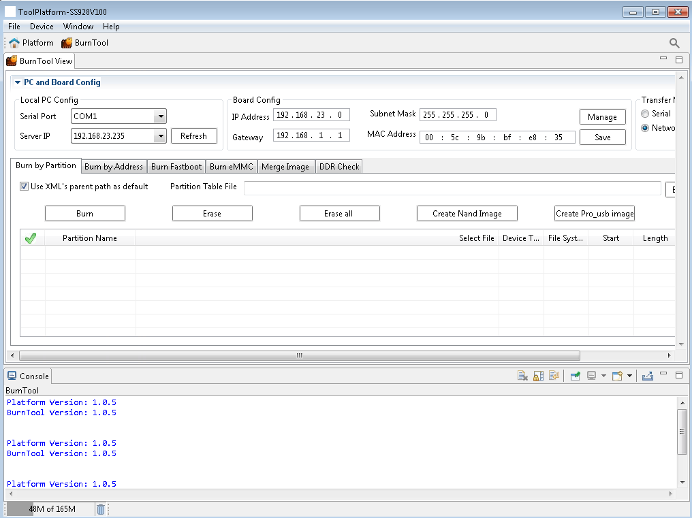
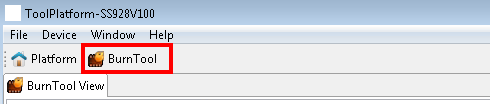
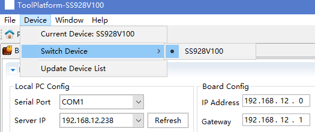
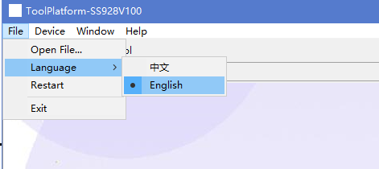
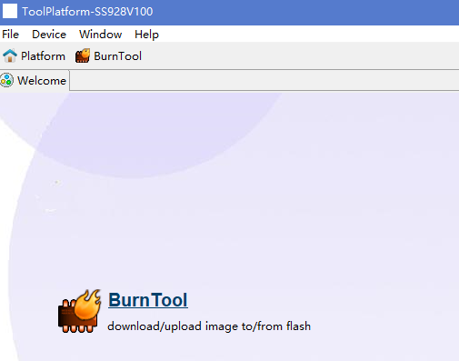
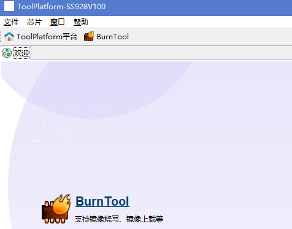
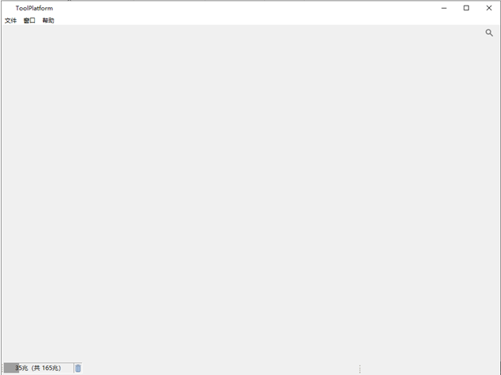

# Preface
**Overview<a name="section192942238173"></a>**

The ToolPlatform framework integrates tools such as BurnTool, FastplayBinTool, and LoaderBinTool into a unified platform. This document describes the features and usage of the platform framework.

> **Note:** 
>This document uses Hi3403V100 as the reference. Unless otherwise specified, SS528V100, SS524V100, SS522V100, SS626V100, and Hi3519AV200 are identical to Hi3403V100.

**Product Versions<a name="section329632361710"></a>**

The product versions corresponding to this document are listed below.

<a name="table63061223201717"></a>
<table><thead align="left"><tr id="row143464239179"><th class="cellrowborder" valign="top" width="31.759999999999998%" id="mcps1.1.3.1.1"><p id="p73461923111715"><a name="p73461923111715"></a><a name="p73461923111715"></a>Product Name</p>
</th>
<th class="cellrowborder" valign="top" width="68.24%" id="mcps1.1.3.1.2"><p id="p17346142312178"><a name="p17346142312178"></a><a name="p17346142312178"></a>Product Version</p>
</th>
</tr>
</thead>
<tbody><tr id="row1034642371711"><td class="cellrowborder" valign="top" width="31.759999999999998%" headers="mcps1.1.3.1.1 "><p id="p1134682313174"><a name="p1134682313174"></a><a name="p1134682313174"></a>Hi3403V100</p>
</td>
<td class="cellrowborder" valign="top" width="68.24%" headers="mcps1.1.3.1.2 "><p id="p43461623201712"><a name="p43461623201712"></a><a name="p43461623201712"></a>V100</p>
</td>
</tr>
<tr id="row78311510142213"><td class="cellrowborder" valign="top" width="31.759999999999998%" headers="mcps1.1.3.1.1 "><p id="p1083151018221"><a name="p1083151018221"></a><a name="p1083151018221"></a>SS626</p>
</td>
<td class="cellrowborder" valign="top" width="68.24%" headers="mcps1.1.3.1.2 "><p id="p583114100228"><a name="p583114100228"></a><a name="p583114100228"></a>V100</p>
</td>
</tr>
<tr id="row117591411104615"><td class="cellrowborder" valign="top" width="31.759999999999998%" headers="mcps1.1.3.1.1 "><p id="p881081984715"><a name="p881081984715"></a><a name="p881081984715"></a>SS524</p>
</td>
<td class="cellrowborder" valign="top" width="68.24%" headers="mcps1.1.3.1.2 "><p id="p34921898474"><a name="p34921898474"></a><a name="p34921898474"></a>V100</p>
</td>
</tr>
<tr id="row1261624112613"><td class="cellrowborder" valign="top" width="31.759999999999998%" headers="mcps1.1.3.1.1 "><p id="p13616148261"><a name="p13616148261"></a><a name="p13616148261"></a>SS522</p>
</td>
<td class="cellrowborder" valign="top" width="68.24%" headers="mcps1.1.3.1.2 "><p id="p196165412612"><a name="p196165412612"></a><a name="p196165412612"></a>V100</p>
</td>
</tr>
<tr id="row4600539165"><td class="cellrowborder" valign="top" width="31.759999999999998%" headers="mcps1.1.3.1.1 "><p id="p146701318175918"><a name="p146701318175918"></a><a name="p146701318175918"></a>SS528</p>
</td>
<td class="cellrowborder" valign="top" width="68.24%" headers="mcps1.1.3.1.2 "><p id="p146705184594"><a name="p146705184594"></a><a name="p146705184594"></a>V100</p>
</td>
</tr>
<tr id="row582312263526"><td class="cellrowborder" valign="top" width="31.759999999999998%" headers="mcps1.1.3.1.1 "><p id="p4824526195210"><a name="p4824526195210"></a><a name="p4824526195210"></a>SS625</p>
</td>
<td class="cellrowborder" valign="top" width="68.24%" headers="mcps1.1.3.1.2 "><p id="p138241269524"><a name="p138241269524"></a><a name="p138241269524"></a>V100</p>
</td>
</tr>
<tr id="row206101594251"><td class="cellrowborder" valign="top" width="31.759999999999998%" headers="mcps1.1.3.1.1 "><p id="p8622349102117"><a name="p8622349102117"></a><a name="p8622349102117"></a>Hi3519AV200</p>
</td>
<td class="cellrowborder" valign="top" width="68.24%" headers="mcps1.1.3.1.2 "><p id="p9185184311112"><a name="p9185184311112"></a><a name="p9185184311112"></a>V100</p>
</td>
</tr>
</tbody>
</table>

**Intended Audience<a name="section3304423191719"></a>**

This document is intended for the following engineers:

-   Technical support engineers
-   Software development engineers

**Revision History<a name="section1530582391712"></a>**

The revision history accumulates the description of each document update. The latest version of this document incorporates all updates from previous versions.

<a name="table1557726816410"></a>
<table><thead align="left"><tr id="row2942532716410"><th class="cellrowborder" valign="top" width="20.72%" id="mcps1.1.4.1.1"><p id="p3778275416410"><a name="p3778275416410"></a><a name="p3778275416410"></a><strong id="b5687322716410"><a name="b5687322716410"></a><a name="b5687322716410"></a>Document Version</strong></p>
</th>
<th class="cellrowborder" valign="top" width="20.22%" id="mcps1.1.4.1.2"><p id="p5627845516410"><a name="p5627845516410"></a><a name="p5627845516410"></a><strong id="b5800814916410"><a name="b5800814916410"></a><a name="b5800814916410"></a>Release Date</strong></p>
</th>
<th class="cellrowborder" valign="top" width="59.06%" id="mcps1.1.4.1.3"><p id="p2382284816410"><a name="p2382284816410"></a><a name="p2382284816410"></a><strong id="b3316380216410"><a name="b3316380216410"></a><a name="b3316380216410"></a>Change Description</strong></p>
</th>
</tr>
</thead>
<tbody><tr id="row5947359616410"><td class="cellrowborder" valign="top" width="20.72%" headers="mcps1.1.4.1.1 "><p id="p2149706016410"><a name="p2149706016410"></a><a name="p2149706016410"></a>00B01</p>
</td>
<td class="cellrowborder" valign="top" width="20.22%" headers="mcps1.1.4.1.2 "><p id="p648803616410"><a name="p648803616410"></a><a name="p648803616410"></a>2025-09-15</p>
</td>
<td class="cellrowborder" valign="top" width="59.06%" headers="mcps1.1.4.1.3 "><p id="p1946537916410"><a name="p1946537916410"></a><a name="p1946537916410"></a>First interim release.</p>
</td>
</tr>
</tbody>
</table>

# ToolPlatform Overview
## Tool Overview<a name="ZH-CN_TOPIC_0000002408169708"></a>

The platform framework is an integration platform for other tools. It can host multiple tools simultaneously, providing a common runtime environment and shared functionality for each integrated tool.

## Tool Interface Overview<a name="ZH-CN_TOPIC_0000002441768857"></a>

When the tool platform is launched, you will see the splash screen shown in [Figure 1](#1-1).

**Figure 1**  Tool splash screen<a name="1-1"></a>  


After the splash screen closes, the tool home page is displayed, as shown in [Figure 2](#_Ref403114108).

**Figure 2**  Tool home page<a name="_Ref403114108"></a>  


The tool home page layout from top to bottom consists of:

-   1. Menu bar
-   2. Toolbar
-   3. Perspective bar

When you switch to a different tool perspective, the toolbar buttons specific to that tool are displayed. Clicking a button invokes the corresponding function.

In the main ToolPlatform window, you can view all available perspectives, including the platform's own perspective and the perspectives of any installed and activated tools, as shown in [Figure 3](#1-3).

**Figure 3**  Installed perspectives<a name="1-3"></a>  


Click a perspective icon to switch to the corresponding tool view. Perspective shortcut icons can be deleted or dragged to reorder them.

# Profile Management
## Switching Profiles<a name="ZH-CN_TOPIC_0000002441889037"></a>

You can switch the current device profile using the ToolPlatform menu bar. After switching, each integrated tool automatically checks whether it supports the new profile; tools that do not support the selected profile will be disabled.

Navigate to **Device** > **Switch Device** in the menu bar and select the target profile, as shown in [Figure 1](#_Ref377548814).

**Figure 1**  Profile switch menu<a name="_Ref377548814"></a>  

## Tool Compatibility with Profiles<a name="ZH-CN_TOPIC_0000002408329616"></a>

Navigate to **Device** > **Current Device** in the menu bar to view the currently selected device. The example below shows Hi3403V100 selected, as shown in [Figure 1](#2-3-1).

**Figure 1**  Hi3403V100 selected<a name="2-3-1"></a>  


The ToolPlatform interface displays the tools available for Hi3403V100, as shown in [Figure 2](#2-3-2).

**Figure 2**  Available tools for Hi3403V100<a name="2-3-2"></a>  

# Language Switching
To change the display language, follow these steps:

Launch the tool platform and open the main interface.

1.  Navigate to **File** > **Language** in the menu bar to choose between Chinese and English, as shown in [Figure 1](#6-1).

    **Figure 1**  Language switch menu<a name="6-1"></a>  
    

2.  Click **English**. The tool displays the splash screen while restarting.
3.  Once the restart is complete, the splash screen closes and the main interface is displayed in English, as shown in [Figure 3](#6-3).

    **Figure 2**  English interface<a name="6-2"></a>  
    

4.  To switch back to Chinese, navigate to **File** > **Language** and click **Chinese**. The splash screen is displayed with a progress bar.
5.  Once loading completes, the splash screen closes and the main interface is displayed in Chinese, as shown in [Figure 3](#6-3).

    **Figure 3**  Chinese interface<a name="6-3"></a>  
    
# FAQ
## Tool Running Slowly<a name="ZH-CN_TOPIC_0000002441768849"></a>

**Problem Description<a name="section1518663911276"></a>**

The tool runs slowly during operation. How can performance be improved?

**Solution<a name="section9267755192714"></a>**

This tool is developed in Java, so its behavior follows typical Java application patterns. Slow performance is usually caused by high memory demand during execution (for example, when reading large volumes of register or memory data into the tool). In such cases, increase the memory allocated to the tool.

To configure the tool's memory:

Edit the `ToolPlatform.ini` file in the ToolPlatform installation directory (the file name may vary by version).

Adjust the parameters based on the actual available physical memory of the PC.

Parameter descriptions:

-   Xms512m
    -   Description: Initial heap memory allocated by the JVM.
    -   Default: 1/64 of physical memory.

-   Xmx512m
    -   Description: Maximum heap memory the JVM can allocate (allocated on demand).
    -   Default: 1/4 of physical memory.

-   -XX:PermSize
    -   Description: Initial non-heap memory allocated by the JVM.
    -   Default: 64 MB.

-   -XX:MaxPermSize
    -   Description: Maximum non-heap memory the JVM can allocate (allocated on demand).
    -   Default: 256 MB.

-   -XX:+UseParallelGC
    -   Description: Enables parallel garbage collection.

> **Notice:** 
>-   When free heap memory falls below 40%, the JVM expands the heap up to the -Xmx limit.
>-   When free heap memory exceeds 70%, the JVM shrinks the heap down to the -Xms limit.
>-   It is generally recommended to set -Xms and -Xmx to the same value to avoid heap resizing after each GC cycle.
>-   On multi-core machines, you can try enabling the -XX:+UseParallelGC option.
>-   If -Xmx or -XX:MaxPermSize is not specified or is set too small, the application may throw a `java.lang.OutOfMemoryError`. Reconfigure the parameters and restart ToolPlatform.

## How to Check the JRE Version in Use<a name="ZH-CN_TOPIC_0000002408169720"></a>

**Problem Description<a name="section15553458202815"></a>**

How can I check the currently installed JRE version?

**Solution<a name="section103688892911"></a>**

Run the following command in a console window: `java -version`

## Why Does the Tool Fail to Run When Installed in a Path with Special Characters<a name="ZH-CN_TOPIC_0000002441768869"></a>

**Problem Description<a name="section197723261293"></a>**

When the tool is installed under a path such as `F:\Work!!!!!!!!!!!!!!!!!!!!!\`, an exception is thrown as shown in [Figure 1](#fig326mcpsimp), and the tool cannot start.

**Figure 1**  Path exception prompt<a name="fig326mcpsimp"></a>  


**Root Cause<a name="section16242653152911"></a>**

The underlying Eclipse framework cannot recognize the `!` character, which causes the exception.

**Solution<a name="section9439958182919"></a>**

Avoid installing or running ToolPlatform in directories whose path contains special characters.

## What to Note When Using the Linux Version of ToolPlatform on Ubuntu<a name="ZH-CN_TOPIC_0000002408329628"></a>

**Problem Description<a name="section10787113323014"></a>**

The Linux version of ToolPlatform may fail to start or may experience issues with serial port and network port functionality on Ubuntu. How should this be resolved?

**Solution<a name="section15836241173018"></a>**

-   Normal startup procedure:

    First, grant read/write permissions to the ToolPlatform directory (`chmod 777 -R ToolPlatform`), then enter the directory (`cd ToolPlatform`), and finally launch ToolPlatform with administrator privileges (`sudo ./ToolPlatform`). In most cases the tool will start normally.

-   If ToolPlatform fails to start:

    First, verify that a 32-bit version of JDK 1.6 or later is installed and that the environment variables are configured correctly (check by running `java -version` in a terminal). If the JDK is installed but the tool still fails to start, ToolPlatform depends on GTK libraries. Install the appropriate GTK libraries for your OS using the following commands (for reference only):

    ```
    sudo apt-get install libgtk-3-dev
    sudo apt-get install ia32-libs-gtk
    sudo apt-get install ia32-libs libglib2.0-dev
    sudo apt-get install gtk2-engines
    sudo apt-get install gtk2-engines-*
    sudo apt-get install libgtkmm-2.4-1c2
    sudo apt-get install libcanberra-gtk-module
    sudo apt-get install gtk2-engines:i386
    sudo apt-get install gtk2-engines-*:i386
    sudo apt-get install libgtkmm-2.4-1c2:i386
    sudo apt-get install libcanberra-gtk-module:i386
    sudo apt-get update
    sudo apt-get install libgtk2.0-0
    sudo apt-get install libgtk2.0-0:i386（64-bit）
    sudo apt-get install libxtst6
    sudo apt-get install libxtst6:i386(64-bit)
    ```

-   Serial port not detected in BurnTool:

    Launch the tool using `sudo ./ToolPlatform`.

-   TFTP over network port not working in BurnTool:

    Launch the tool using `sudo ./ToolPlatform`. If the issue persists, check your network environment.

# Abbreviations
<a name="table137mcpsimp"></a>
<table><tbody><tr id="row143mcpsimp"><td class="cellrowborder" colspan="3" valign="top"><p id="p145mcpsimp"><a name="p145mcpsimp"></a><a name="p145mcpsimp"></a><strong id="b146mcpsimp"><a name="b146mcpsimp"></a><a name="b146mcpsimp"></a>A</strong></p>
</td>
</tr>
<tr id="row149mcpsimp"><td class="cellrowborder" valign="top" width="23%"><p id="p151mcpsimp"><a name="p151mcpsimp"></a><a name="p151mcpsimp"></a>API</p>
</td>
<td class="cellrowborder" valign="top" width="30%"><p id="p153mcpsimp"><a name="p153mcpsimp"></a><a name="p153mcpsimp"></a>Application Programming Interface</p>
</td>
<td class="cellrowborder" valign="top" width="47%"><p id="p155mcpsimp"><a name="p155mcpsimp"></a><a name="p155mcpsimp"></a>Application interface</p>
</td>
</tr>
<tr id="row156mcpsimp"><td class="cellrowborder" colspan="3" valign="top"><p id="p158mcpsimp"><a name="p158mcpsimp"></a><a name="p158mcpsimp"></a><strong id="b159mcpsimp"><a name="b159mcpsimp"></a><a name="b159mcpsimp"></a>J</strong></p>
</td>
</tr>
<tr id="row162mcpsimp"><td class="cellrowborder" valign="top" width="23%"><p id="p164mcpsimp"><a name="p164mcpsimp"></a><a name="p164mcpsimp"></a>JRE</p>
</td>
<td class="cellrowborder" valign="top" width="30%"><p id="p166mcpsimp"><a name="p166mcpsimp"></a><a name="p166mcpsimp"></a>Java Runtime Environment</p>
</td>
<td class="cellrowborder" valign="top" width="47%"><p id="p168mcpsimp"><a name="p168mcpsimp"></a><a name="p168mcpsimp"></a>Java runtime environment</p>
</td>
</tr>
<tr id="row169mcpsimp"><td class="cellrowborder" valign="top" width="23%"><p id="p171mcpsimp"><a name="p171mcpsimp"></a><a name="p171mcpsimp"></a>JDK</p>
</td>
<td class="cellrowborder" valign="top" width="30%"><p id="p173mcpsimp"><a name="p173mcpsimp"></a><a name="p173mcpsimp"></a>Java Development Kit</p>
</td>
<td class="cellrowborder" valign="top" width="47%"><p id="p175mcpsimp"><a name="p175mcpsimp"></a><a name="p175mcpsimp"></a>Java development toolkit</p>
</td>
</tr>
</tbody>
</table>
