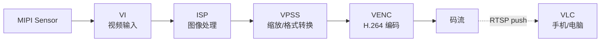

# 教程：采集 → 编码 → 推流

**目标**：从 MIPI 摄像头连续采集 1080p@30fps 的画面，H.264 编码，
推到一个 RTSP 流。手机/电脑上用 VLC 能看到实时画面。

**用时**：约 45 分钟（不算第一次烧镜像）

!!! info "本教程假定的运行环境"

    本教程基于 [`hi3403-build`](../tools/hi3403-build.md) 产出的 Ubuntu 22.04 镜像。
    在这个镜像里，MPP 库装在 `/usr/lib/`，内核模块装在 `/ko/`，
    系统启动时由 `/etc/init.d/topeet-start.sh` 自动 `insmod` 加载。
    其他镜像（OpenHarmony、Buildroot、自建系统）路径会不同 ——
    请按你的实际安装位置调整下面的命令。

**前置条件**：

- 已经按 [quickstart](../get-started/quickstart.md) 把 Hi3403 启动起来了
- 板子上接了一个 MIPI 摄像头模组（IMX415 / IMX385 / SC4210 等都行）
- 手机或电脑跟开发板在同一个局域网

## 整体流程



## 步骤 1 — 确认 MPP 已加载

`hi3403-build` 镜像在第一次开机时会自动跑 `topeet-start.sh` 把
MPP 模块 `insmod` 进内核。验证：

``` bash
lsmod | grep -E 'sys_|isp|venc|vi_|vo_'
```

期望看到一组 `ot_*` / `Hi3403V100_*` 模块已加载。如果空，手动跑一次：

``` bash
cd /ko
sudo bash load_Hi3403V100_ubuntu -i
```

## 步骤 2 — 编译 sample（如果你需要修改）

Pegasus SDK 自带媒体处理 sample 源码。在 **PC 主机**上交叉编译：

``` bash
# 进入 SDK，按 README 设置好 OSDRV_CROSS / 工具链
cd pegasus/platform/Hi3403V100_gcc/smp/a55_linux/mpp/sample/

# 看一下都有哪些 sample
ls
# audio  cipher  common  composite  dis  fisheye  gfbg  hdmi
# hnr  host_uvc  hy_s0603  pqtool  region  snap  ...

# 进入一个能演示采集 → 编码的目录（每家板子会有 venc 或 composite sample；
# 用 build.sh 一键构建过的项目里 sample 二进制已经在 SDK out/ 下）
make -C composite
```

构建完毕后产出物在 `mpp/sample/composite/sample_composite`（具体名字
按你 SDK 版本看 README）。把它拷到板子：

``` bash
scp sample_composite hi@<板子IP>:~/
```

## 步骤 3 — 在板子上跑

SSH 到板子：

``` bash
ssh hi@<板子IP>
chmod +x sample_composite
sudo ./sample_composite          # 不带参数会进交互菜单
```

按提示选择 sensor 类型、分辨率、码率，sample 会启动 VI → ISP → VPSS → VENC
管线，把 H.264 码流写到当前目录的 `.h264` 文件，或推 RTSP（看具体 sample
支持哪种）。

!!! tip "用 hnr / snap / dis 这些方向性 sample"

    Pegasus SDK 默认提供的 sample 各自演示一种能力：

    - `hnr` —— Heterogeneous Noise Reduction 降噪 + 编码
    - `snap` —— 抓拍 + 编码 JPEG
    - `dis` —— 数字防抖 + 编码
    - `composite` —— 多通道混合（最接近完整 IPC 流水线）

    挑跟你目标最接近的一个看代码，比从零写更省事。

## 步骤 4 — 推 RTSP 给 VLC 看

Pegasus SDK 不自带 RTSP server。把 sample 输出的 H.264 码流通过 `live555`
或 `mediamtx` 推出去。最快的做法是用 `mediamtx`（一个 Go 单二进制）：

``` bash
# 在板子上：下载 ARM64 的 mediamtx
wget https://github.com/bluenviron/mediamtx/releases/latest/download/mediamtx_linux_arm64.tar.gz
tar -xzf mediamtx_linux_arm64.tar.gz
./mediamtx &

# sample 写出码流后，用 ffmpeg 推到 mediamtx
ffmpeg -re -i output.h264 -c copy -f rtsp rtsp://localhost:8554/live
```

PC / 手机 VLC：

```
rtsp://<板子IP>:8554/live
```

延迟在 200–500 ms 之间是正常的（`-re` 是按 1× 实时速率读，去掉可以更快但可能丢帧）。

## 步骤 5 — 自己写一段：直接调 MPP API

如果想跳过 sample 直接用 MPP，核心调用顺序是：

``` c
#include "ot_common.h"
#include "ot_common_vi.h"
#include "ot_common_venc.h"
#include "ss_mpi_sys.h"
#include "ss_mpi_vi.h"
#include "ss_mpi_venc.h"

int main(void) {
    // 1. 初始化 MMZ 内存池
    ss_mpi_sys_init();

    // 2. 创建 VI pipe + chn （从 sensor 进来的图）
    ot_vi_pipe_attr pipe_attr = { /* ... 按你的 sensor 填 */ };
    ss_mpi_vi_create_pipe(0, &pipe_attr);
    ss_mpi_vi_set_chn_attr(0, 0, &chn_attr);
    ss_mpi_vi_enable_chn(0, 0);

    // 3. 创建 VENC chn （H.264 编码器）
    ot_venc_chn_attr venc_attr = {
        .venc_attr = {
            .type = OT_PT_H264,
            .pic_width = 1920,
            .pic_height = 1080,
            /* ... */
        },
        .rc_attr = { .rc_mode = OT_VENC_RC_MODE_H264_CBR, /* ... */ },
    };
    ss_mpi_venc_create_chn(0, &venc_attr);

    // 4. 把 VI 输出绑到 VENC 输入
    ot_mpp_chn vi_chn = { OT_ID_VI, 0, 0 };
    ot_mpp_chn venc_chn = { OT_ID_VENC, 0, 0 };
    ss_mpi_sys_bind(&vi_chn, &venc_chn);

    // 5. 启动接收器
    ot_venc_recv_pic_param recv = { .recv_pic_num = -1 };
    ss_mpi_venc_start_recv_frame(0, &recv);

    // 6. 取码流（在另一个线程做 RTSP push）
    ot_venc_stream stream;
    while (running) {
        ss_mpi_venc_get_stream(0, &stream, -1);
        // → push to RTSP / write to file / ...
        ss_mpi_venc_release_stream(0, &stream);
    }

    /* cleanup ... */
    return 0;
}
```

完整可编译代码在
`pegasus/platform/Hi3403V100_gcc/smp/a55_linux/mpp/sample/composite/`。

## 调优常见问题

| 现象 | 怎么改 |
|---|---|
| **画面发紫 / 偏色** | 跑 [ISP 颜色调优](isp-color-tuning.md) |
| **延迟高** | VENC 改成 `OT_VENC_RC_MODE_H264_VBR` + GOP=15 |
| **码率太高** | `rc_attr.target_bitrate` 调小 |
| **CPU 占用高** | 客户端用硬解（VLC 默认软解）|
| **找不到 sensor** | 看 [Sensor 调试指南](../multimedia/isp/sensor/index.md) |

## 接下来

<div class="grid cards" markdown>

-   :material-brain:{ .lg .middle } __把推流接上 AI 推理__

    ---

    在 VENC 之前加一路 SVP 推理，画检测框再编码。

    [:octicons-arrow-right-24: SVP 第一次推理](svp-first-inference.md)

-   :material-bookshelf:{ .lg .middle } __MPP 视频输入参考__

    ---

    [:octicons-arrow-right-24: MPP 03 · 视频输入](../multimedia/mpp/03-视频输入.md)

</div>
