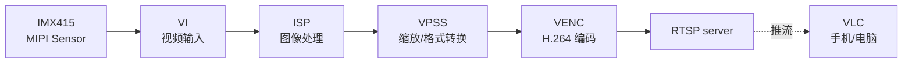

# 教程：采集 → 编码 → 推流

**目标**：从 MIPI 摄像头连续采集 1080p@30fps 的画面，H.264 编码，
推到一个 RTSP 流。手机/电脑上用 VLC 能看到实时画面。

**用时**：约 45 分钟（不算第一次烧镜像）

**前置条件**：

- 已经按照 [quickstart](../get-started/quickstart.md) 把 Hi3403 启动起来了
- 板子上接了一个 MIPI 摄像头模组（IMX415 / IMX385 / SC4210 等都行，
  本教程用 IMX415）
- 手机或电脑跟开发板在同一个局域网

## 整体流程



## 步骤 1 — 配置 sensor

板子上的 sensor 接到哪一路 MIPI lane？看你板子的原理图。在
`/etc/hi3403/sensor.conf` 里设置（这是 hi3403-build 镜像的默认路径）：

``` ini
[sensor0]
type = imx415
lane = 0
fps = 30
resolution = 3840x2160
```

让 MPP 重新加载：

``` bash
sudo systemctl restart hi3403-mpp
```

## 步骤 2 — 启动 MPP sample

Hi3403 SDK 自带一个完整的采集-编码-推流 sample：

``` bash
cd /opt/hi3403/sample/venc
sudo ./sample_venc rtsp imx415 1080p
```

这会启动一个 RTSP 服务器，监听 8554 端口，推流路径 `/live`。

期望输出：

```
[INFO] sensor imx415 ok, 1080p@30fps
[INFO] ISP started, MMZ pool: 256 MB
[INFO] VPSS chn 0: 1920x1080 NV12
[INFO] VENC chn 0: H.264 baseline, 4 Mbps
[INFO] RTSP server listening on rtsp://0.0.0.0:8554/live
```

如果看到 sensor probe 失败，请回头检查 [sensor 调试](../multimedia/isp/sensor/index.md)。

## 步骤 3 — 在客户端打开

查到板子的 IP：

``` bash
hostname -I       # 在板子上跑
# e.g. 192.168.1.42
```

用 VLC 打开（手机版 / 桌面版都可以）：

```
rtsp://192.168.1.42:8554/live
```

延迟应该在 200 ms 以内。

## 步骤 4 — 写自己的采集 + 编码代码

如果想直接调 MPP API 做这件事（不依赖 sample），核心调用顺序是：

``` c
#include "ot_common.h"
#include "ot_common_vi.h"
#include "ot_common_venc.h"
#include "ss_mpi_sys.h"
#include "ss_mpi_vi.h"
#include "ss_mpi_venc.h"

int main(void) {
    // 1. 初始化 MMZ 内存池
    ss_mpi_sys_init();

    // 2. 创建 VI pipe + chn （从 sensor 进来的图）
    ot_vi_pipe_attr pipe_attr = { /* ... */ };
    ss_mpi_vi_create_pipe(0, &pipe_attr);
    ss_mpi_vi_set_chn_attr(0, 0, &chn_attr);
    ss_mpi_vi_enable_chn(0, 0);

    // 3. 创建 VENC chn （H.264 编码器）
    ot_venc_chn_attr venc_attr = {
        .venc_attr = {
            .type = OT_PT_H264,
            .pic_width = 1920,
            .pic_height = 1080,
            /* ... */
        },
        .rc_attr = { .rc_mode = OT_VENC_RC_MODE_H264_CBR, /* ... */ },
    };
    ss_mpi_venc_create_chn(0, &venc_attr);

    // 4. 把 VI 输出绑到 VENC 输入
    ot_mpp_chn vi_chn = { OT_ID_VI, 0, 0 };
    ot_mpp_chn venc_chn = { OT_ID_VENC, 0, 0 };
    ss_mpi_sys_bind(&vi_chn, &venc_chn);

    // 5. 启动接收器
    ot_venc_recv_pic_param recv = { .recv_pic_num = -1 };
    ss_mpi_venc_start_recv_frame(0, &recv);

    // 6. 取码流（在另一个线程做 RTSP push）
    ot_venc_stream stream;
    while (running) {
        ss_mpi_venc_get_stream(0, &stream, -1);
        // → push to RTSP / write to file / ...
        ss_mpi_venc_release_stream(0, &stream);
    }

    /* cleanup ... */
    return 0;
}
```

完整可编译的代码在 SDK 的 `sample/venc/sample_venc.c`。

## 调优

| 现象 | 怎么改 |
|---|---|
| **画面发紫 / 偏色** | 跑 [ISP 颜色调优](isp-color-tuning.md) |
| **延迟高** | VENC 改成 `OT_VENC_RC_MODE_H264_VBR` + GOP=15 |
| **码率太高** | 在 `rc_attr.target_bitrate` 调小 |
| **CPU 占用高** | 客户端用硬解（VLC 默认软解）|
| **IPC 设备验收测试** | 接 [BurnTool](../tools/burntool/index.md) 抓性能 |

## 接下来

<div class="grid cards" markdown>

-   :material-brain:{ .lg .middle } __把推流接上 AI 推理__

    ---

    在 VENC 之前加一路 SVP 推理，画检测框再编码。

    [:octicons-arrow-right-24: SVP 第一次推理](svp-first-inference.md)

-   :material-bookshelf:{ .lg .middle } __VI / VENC API 全集__

    ---

    [:octicons-arrow-right-24: 视频输入 / 输出 / 处理](../multimedia/video/index.md)

</div>
