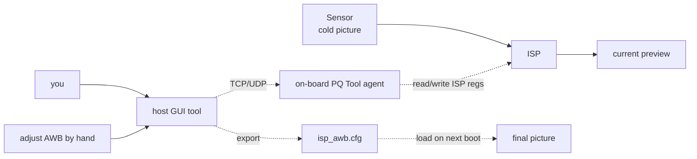
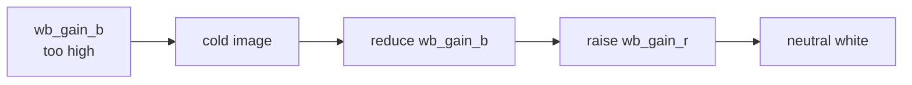

# Tutorial: fix an ISP color bug

**Goal**: your board has an IMX415 module attached, but the picture
comes out cold (too blue). This tutorial walks the debug loop: connect
the host PQ Tool / ToolPlatform to the on-board ISP-debug agent, tweak
AWB live, and persist the result to SYS_CONFIG.

**Time**: ~30–45 minutes

!!! info "Tool naming"

    HiSilicon offers two image-quality tuning tools for SS928V100:

    - **PQ Tool** (a.k.a. IQS / Image Quality Studio) — typically a
      Windows GUI; the Pegasus SDK provides the on-board agent source
      under `mpp/sample/pqtool/`.
    - **ToolPlatform** — HiSilicon's broader visual-debug platform that
      covers more than just ISP.

    This tutorial walks the PQ Tool path. Specific tool versions and
    UI details — see
    [Image Quality Studio guide](../tools/iqs-debug/index.md).

**Prerequisites**:

- Board produces a usable picture (the [capture tutorial](capture-encode-stream.md) works)
- Host has PQ Tool / ToolPlatform installed (see
  [IQS debug](../tools/iqs-debug/index.md))
- Board and host on the same LAN

## High-level flow



## Step 1 — Start the on-board PQ Tool agent

The PQ Tool agent comes from `mpp/sample/pqtool/` in the SDK. The
`hi3403-build` image does **not** auto-start it — launch by hand when
debugging:

``` bash
# On the board — path depends on where you copied the SDK sample.
# Suppose you cross-built mpp/sample/pqtool on the host and then scp'd
# the result to ~/pqtool/ on the board:
cd ~/pqtool
sudo ./pqtool_agent &
```

The agent listens on a TCP port (typically 5000 or 50000 — check the
PQ Tool main app's connection dialog).

## Step 2 — Connect from the host

Launch PQ Tool (Windows GUI). In *Connect*, fill the board IP and
connect. Once connected, the UI should show the live sensor name
(IMX415) and the current ISP parameters.

## Step 3 — Find the problem: color temperature

In the PQ Tool main panel:

1. Side nav: **ISP → AWB (auto white balance)**
2. Look at *Current ColorTemp* — should be around 5500 K (D55, midday sunlight)
3. If it reads ~7000 K (blueish), AWB has settled at the wrong point

## Step 4 — Tweak parameters live

Core knobs in the AWB panel:

| Param | One-line meaning | Knob |
|---|---|---|
| `wb_gain_b/g/r` | RGB-channel gains | **Main one to adjust** |
| AWB mode (Auto/Manual) | Auto-converge or manual | Switch to Manual while debugging |
| `awb_zone_weight` | Per-zone weight grid | High weight in center, low at edges |

**Fixing "too cold"**:

1. Switch AWB mode from *AUTO* to *MANUAL* — required to see live changes
2. Lower `wb_gain_b` from 1.30 → 1.10
3. Raise `wb_gain_r` from 0.95 → 1.05
4. Watch the live preview — white objects should look truly white now



## Step 5 — Verify with AUTO again

Switch AWB back to *AUTO*. The picture should auto-converge to neutral.
If it still drifts off, the issue isn't `wb_gain` — it could be
`awb_zone_weight` (center weight too low) or color shift in the sensor
RAW itself.

Deeper debugging path: [ISP color tuning](../multimedia/isp/color/index.md).

## Step 6 — Persist to a config file

Save the params to a SYS_CONFIG snippet:

1. Toolbar: **File → Export → SYS_CONFIG** (menu name varies slightly
   by version)
2. Filename: `imx415_awb.cfg`
3. The file looks roughly like:

``` ini
[isp_awb_imx415]
wb_gain_b = 1.10
wb_gain_g = 1.00
wb_gain_r = 1.05
awb_run_interval = 1
zone_weight = "16,16,...,16"   # 17x17 zone weights
```

## Step 7 — Push the config to the board

Copy `imx415_awb.cfg` to the board's SYS_CONFIG directory. **The exact
target directory varies per OS image**:

- **`hi3403-build` Ubuntu image** — typically `/etc/sys_config.d/` or
  whatever location the sample / `topeet-start.sh` reads at startup
- **OpenHarmony Small** — see [OpenHarmony porting](../os/openharmony/porting/index.md)
- **OpenEuler / Buildroot** — see each OS's porting guide

Generic flow on the Ubuntu + topeet-start.sh image:

``` bash
scp imx415_awb.cfg hi@<board-IP>:/tmp/
ssh hi@<board-IP> "sudo mv /tmp/imx415_awb.cfg /etc/sys_config.d/"
```

Reload ISP by rebooting (simplest):

``` bash
sudo reboot
```

Next boot, the sample / `topeet-start.sh` reads the cfg and pushes the
ISP parameters in.

## Still broken?

| Symptom | Likely cause | See |
|---|---|---|
| Color shift won't go away | Sensor RAW itself is shifted (defective) | [Sensor debug](../multimedia/isp/sensor/index.md) |
| Tweaks lost after reboot | Config path wrong / SYS_CONFIG not loaded | [SYS_CONFIG guide](../reference/sys-config/index.md) |
| Cold in low light only | Low-light AWB is a different parameter set | [ISP tuning](../multimedia/isp/tuning/index.md) |
| HDR scene over-exposed | That's AE, not AWB | [ISP dev reference](../multimedia/isp/dev-ref/index.md) |

## Next

<div class="grid cards" markdown>

-   :material-image-frame:{ .lg .middle } __Full ISP tuning__

    ---

    Beyond AWB — Gamma, HDR, 3DNR, sharpening.

    [:octicons-arrow-right-24: ISP tuning guide](../multimedia/isp/tuning/index.md)

-   :material-bookshelf:{ .lg .middle } __ISP development reference__

    ---

    Per-module APIs, register meanings, valid ranges.

    [:octicons-arrow-right-24: ISP dev reference](../multimedia/isp/dev-ref/index.md)

</div>
