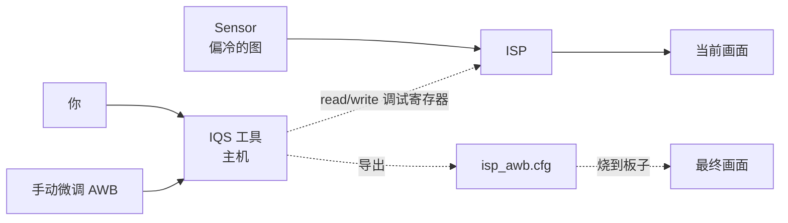
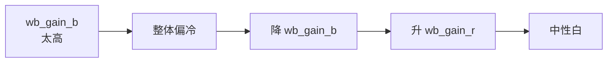

# 教程：调一个 ISP 颜色 bug

**目标**：你的板子接了一个 IMX415 模组，但拍出来的画面比真实场景偏冷
（蓝偏多）。本教程教你用 IQS（图像质量调试工具）实时调 AWB 参数、
存成配置文件、烧到板子。

**用时**：约 30 分钟

**前置条件**：

- 板子已经能正常出图（[采集教程](capture-encode-stream.md) 跑通了）
- 主机装好了 [图像质量调试工具 (IQS)](../tools/iqs-debug/index.md)
- 板子和主机在同一个局域网

## 整体流程



## 步骤 1 — 启动板端调试服务

板子上：

``` bash
sudo systemctl start hi3403-iqs-server
sudo systemctl status hi3403-iqs-server
# 应该显示 listening on 0.0.0.0:50000
```

## 步骤 2 — 主机连接

主机上启动 IQS：

``` bash
iqs --target 192.168.1.42:50000
```

界面打开后，左上角的 sensor 名字应该已经显示 `IMX415`。
中间是实时预览。

## 步骤 3 — 找问题：色温

在 IQS 主面板：

1. 左侧导航：**ISP → AWB（自动白平衡）**
2. 看 *Current ColorTemp* 读数 —— 应该是 5500 K 左右（D55，正午阳光）
3. 如果读数显示 ~7000 K（偏蓝），说明 AWB 收敛位置偏了

## 步骤 4 — 改参数实时观察

在 AWB 面板里有几个调节旋钮：

| 参数 | 一句话解释 | 调整方向 |
|---|---|---|
| `awb_run_interval` | AWB 多少帧跑一次 | 通常保持 1（每帧） |
| `awb_zone_weight` | 不同区域的权重表 | 中心给高权重，边角降低 |
| `static_wb` | 强制白平衡值 | 仅诊断用 |
| `wb_gain_b/g/r` | RGB 增益 | **本次主要调这三个** |

**修复偏冷的步骤**：

1. 先把 AWB 模式从 *AUTO* 切到 *MANUAL* —— 看着实时画面调
2. 把 `wb_gain_b` 从 1.30 调到 1.10（蓝色 gain 降下来）
3. 把 `wb_gain_r` 从 0.95 调到 1.05（红色 gain 拉上去）
4. 实时看预览 —— 白色物体应该接近真白了



## 步骤 5 — 复合验证

调好后让 AWB 切回 *AUTO* —— 画面应该自动收敛到正确的中性白。如果还是偏，
说明问题不在 wb_gain，可能在 awb_zone_weight（中心区域权重）或者
sensor 的 RAW 输出本身有偏色。

进一步排查路径：[ISP 颜色调优说明](../multimedia/isp/color/index.md)

## 步骤 6 — 保存到配置文件

把当前的参数固化到一个 SYS_CONFIG 段：

1. IQS 工具栏：**File → Export → SYS_CONFIG**
2. 文件名 `imx415_awb.cfg`
3. 文件里看到大概是：

``` ini
[isp_awb_imx415]
wb_gain_b = 1.10
wb_gain_g = 1.00
wb_gain_r = 1.05
awb_run_interval = 1
zone_weight = "16,16,16,...,16"   # 17x17 zone weights
```

## 步骤 7 — 把配置烧到板子

把 `imx415_awb.cfg` 拷到板子的 `/etc/hi3403/sys_config.d/` 目录：

``` bash
scp imx415_awb.cfg hi@192.168.1.42:/tmp/
ssh hi@192.168.1.42 "sudo mv /tmp/imx415_awb.cfg /etc/hi3403/sys_config.d/"
```

让 ISP 重新加载：

``` bash
sudo systemctl restart hi3403-mpp
```

下一次启动板子时就会自动加载这套 AWB 参数 —— 永久生效。

## 没解决？

| 症状 | 可能原因 | 链接 |
|---|---|---|
| 怎么调都偏色 | sensor 输出已经有色偏（次品） | [Sensor 调试指南](../multimedia/isp/sensor/index.md) |
| 调好的参数重启就丢 | 配置文件路径不对 / SYS_CONFIG 没加载 | [SYS_CONFIG 配置指南](../reference/sys-config/index.md) |
| 暗光下还是冷 | low-light AWB 是另一组参数 | [ISP 图像调优指南](../multimedia/isp/tuning/index.md) |
| 高动态场景过曝 | 看 AE，不是 AWB | [ISP 开发参考](../multimedia/isp/dev-ref/index.md) |

## 接下来

<div class="grid cards" markdown>

-   :material-image-frame:{ .lg .middle } __做完整的 ISP 调优__

    ---

    超越 AWB —— Gamma、HDR、3DNR、锐化的全套调优流程。

    [:octicons-arrow-right-24: ISP 图像调优指南](../multimedia/isp/tuning/index.md)

-   :material-bookshelf:{ .lg .middle } __ISP 开发参考__

    ---

    每个 ISP 模块的 API、寄存器含义、可配置范围。

    [:octicons-arrow-right-24: ISP 开发参考](../multimedia/isp/dev-ref/index.md)

</div>
