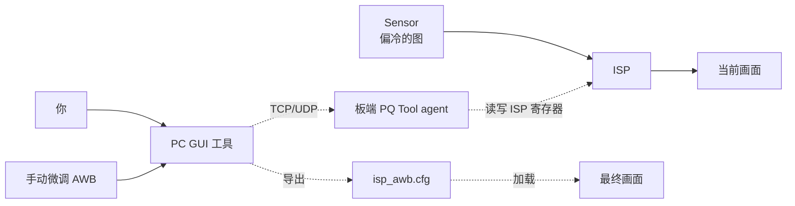
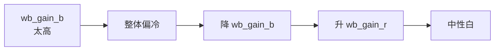

# 教程：调一个 ISP 颜色 bug

**目标**：你的板子接了一个 IMX415 模组，但拍出来的画面比真实场景偏冷
（蓝偏多）。本教程介绍调试链路：用海思官方 PQ 工具 / ToolPlatform 在
PC 上连到板子上的 ISP 调试代理、实时改 AWB 参数、把结果固化到 SYS_CONFIG。

**用时**：约 30–45 分钟

!!! info "工具命名说明"

    海思针对 Hi3403V100 的图像质量调优工具有两条路线：

    - **PQ Tool**（也叫 IQS / Image Quality Studio）—— 通常是 Windows GUI，
      Pegasus SDK 的 `mpp/sample/pqtool/` 提供板端 agent 源码。
    - **ToolPlatform** —— 海思的可视化调试平台，覆盖 ISP 之外更多模块。

    本教程用 PQ Tool 路线。具体工具版本和操作以
    [图像质量调试工具使用指南](../tools/iqs-debug/index.md) 为准。

**前置条件**：

- 板子已经能正常出图（[采集教程](capture-encode-stream.md) 跑通了）
- 主机装好了 PQ Tool / ToolPlatform（见
  [图像质量调试工具](../tools/iqs-debug/index.md)）
- 板子和主机在同一个局域网

## 整体流程



## 步骤 1 — 启动板端 PQ Tool agent

PQ Tool agent 来自 SDK 的 `mpp/sample/pqtool/`。`hi3403-build` 镜像默认
**没有**自动起这个 agent —— 调试时手动启动：

``` bash
# 在板子上 —— 路径取决于你把 SDK sample 拷到了哪儿。
# 假设你已经从 PC 主机交叉编译 mpp/sample/pqtool 后 scp 到了
# 板子的 ~/pqtool/ 目录：
cd ~/pqtool
sudo ./pqtool_agent &
```

agent 启动后会 listen 在某个 TCP 端口（一般 5000 或 50000，
看 PQ Tool 主程序连接配置）。

## 步骤 2 — 主机连接

主机上启动 PQ Tool（Windows GUI），在 *Connect* 对话框填板子 IP，连接。
连上后界面应该实时显示 sensor 名（IMX415）和当前 ISP 参数。

## 步骤 3 — 找问题：色温

在 PQ Tool 主面板：

1. 左侧导航：**ISP → AWB（自动白平衡）**
2. 看 *Current ColorTemp* 读数 —— 应该在 5500 K 左右（D55，正午阳光）
3. 如果读数显示 ~7000 K（偏蓝），说明 AWB 收敛位置偏了

## 步骤 4 — 改参数实时观察

AWB 面板里的核心调节旋钮：

| 参数 | 一句话解释 | 调整方向 |
|---|---|---|
| `wb_gain_b/g/r` | RGB 通道增益 | **本次主要调这三个** |
| AWB 模式 (Auto/Manual) | 是否自动收敛 | 调试时切 Manual |
| `awb_zone_weight` | 不同区域的权重表 | 中心高权重，边角降低 |

**修复偏冷的步骤**：

1. 把 AWB 模式从 *AUTO* 切到 *MANUAL* —— 才能看着实时画面调
2. 把 `wb_gain_b` 从 1.30 调到 1.10（蓝色 gain 降下来）
3. 把 `wb_gain_r` 从 0.95 调到 1.05（红色 gain 拉上去）
4. 实时看预览 —— 白色物体应该接近真白了



## 步骤 5 — 复合验证

调好后让 AWB 切回 *AUTO* —— 画面应该自动收敛到正确的中性白。如果还偏，
说明问题不在 wb_gain，可能在 awb_zone_weight（中心区域权重）或者
sensor RAW 输出本身有偏色。

进一步排查路径：[ISP 颜色调优说明](../multimedia/isp/color/index.md)

## 步骤 6 — 保存到配置文件

把当前参数固化到 SYS_CONFIG：

1. PQ Tool 工具栏：**File → Export → SYS_CONFIG**（菜单名按版本可能略不同）
2. 文件名 `imx415_awb.cfg`
3. 文件大体结构：

``` ini
[isp_awb_imx415]
wb_gain_b = 1.10
wb_gain_g = 1.00
wb_gain_r = 1.05
awb_run_interval = 1
zone_weight = "16,16,...,16"   # 17x17 zone weights
```

## 步骤 7 — 把配置烧到板子

把 `imx415_awb.cfg` 拷到板子的 SYS_CONFIG 目录。**具体目录因系统不同而不同**：

- **`hi3403-build` 的 Ubuntu 镜像**：通常放在 `/etc/sys_config.d/`
  或随 sample 目录下的 `*.cfg`，启动脚本 `/etc/init.d/topeet-start.sh`
  里负责加载
- **OpenHarmony Small**：参考 [OpenHarmony 移植案例](../os/openharmony/porting/index.md)
- **OpenEuler / Buildroot**：参考各自移植指南

通用做法（以 Ubuntu 镜像 + topeet-start.sh 为例）：

``` bash
scp imx415_awb.cfg hi@<板子IP>:/tmp/
ssh hi@<板子IP> "sudo mv /tmp/imx415_awb.cfg /etc/sys_config.d/"
```

让 ISP 重新加载（最简单：重启板子）：

``` bash
sudo reboot
```

下一次启动时 sample / topeet-start.sh 会读这个 cfg 注入 ISP 参数。

## 没解决？

| 症状 | 可能原因 | 链接 |
|---|---|---|
| 怎么调都偏色 | sensor 输出已经有色偏（次品） | [Sensor 调试指南](../multimedia/isp/sensor/index.md) |
| 调好的参数重启就丢 | 配置文件路径不对 / SYS_CONFIG 没加载 | [SYS_CONFIG 配置指南](../reference/sys-config/index.md) |
| 暗光下还是冷 | low-light AWB 是另一组参数 | [ISP 图像调优指南](../multimedia/isp/tuning/index.md) |
| 高动态场景过曝 | 看 AE，不是 AWB | [ISP 开发参考](../multimedia/isp/dev-ref/index.md) |

## 接下来

<div class="grid cards" markdown>

-   :material-image-frame:{ .lg .middle } __做完整的 ISP 调优__

    ---

    超越 AWB —— Gamma、HDR、3DNR、锐化的全套调优流程。

    [:octicons-arrow-right-24: ISP 图像调优指南](../multimedia/isp/tuning/index.md)

-   :material-bookshelf:{ .lg .middle } __ISP 开发参考__

    ---

    每个 ISP 模块的 API、寄存器含义、可配置范围。

    [:octicons-arrow-right-24: ISP 开发参考](../multimedia/isp/dev-ref/index.md)

</div>
